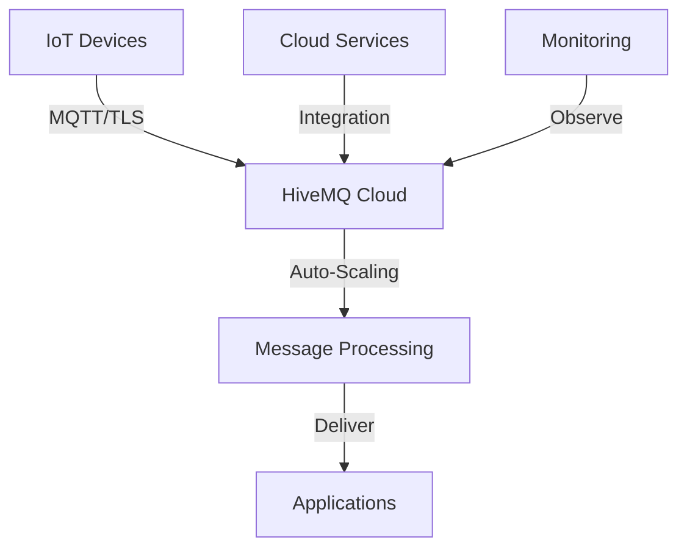

**Category:** Real-time & WebSocket Hosting
**Difficulty:** Intermediate
**Reading time:** 6 min read

---

HiveMQ Cloud is a managed MQTT broker service providing enterprise-grade reliability for IoT deployments. It offers automatic scaling, security, and operational simplicity for MQTT networks.

- **Fully Managed Service** — no infrastructure management needed
- **Enterprise Features** — authentication, encryption, monitoring
- **High Availability** — multi-region deployment options
- **Compliance** — meeting regulatory requirements
- **Integration Ready** — connecting to cloud services

HiveMQ Cloud manages MQTT brokers on behalf of customers, handling infrastructure, updates, and scaling. Devices connect securely using TLS encryption. The platform scales automatically based on message volume. Built-in authentication and authorization control access. Integration with cloud services like AWS IoT and Azure enables hybrid deployments. Monitoring dashboards track connections, message rates, and broker health. The service maintains high availability through redundancy and failover. Compliance features help meet regulatory requirements. API integrations simplify application development.

- Industrial IoT deployments
- Smart building systems
- Fleet management
- Sensor networks
- Remote monitoring
- Environmental data collection
- Manufacturing systems

| Advantage | Disadvantage |
|-----------|--------------|
| No operational burden | Vendor lock-in concerns |
| Enterprise features included | Higher cost than self-hosted |
| Excellent reliability | Compliance complexity remains |
| Good scaling capabilities | Less control than self-hosted |
| Strong security built-in | Feature limitations based on tier |

- [MQTT enterprise deployment](mqtt-enterprise.md)
- [IoT security practices](iot-security.md)
- [Cloud MQTT services comparison](mqtt-comparison.md)

---
*Part of the [Real-time & WebSocket Hosting](real-time-websocket-hosting/index.md) category · [Back to Master Index](../../index.md)*
