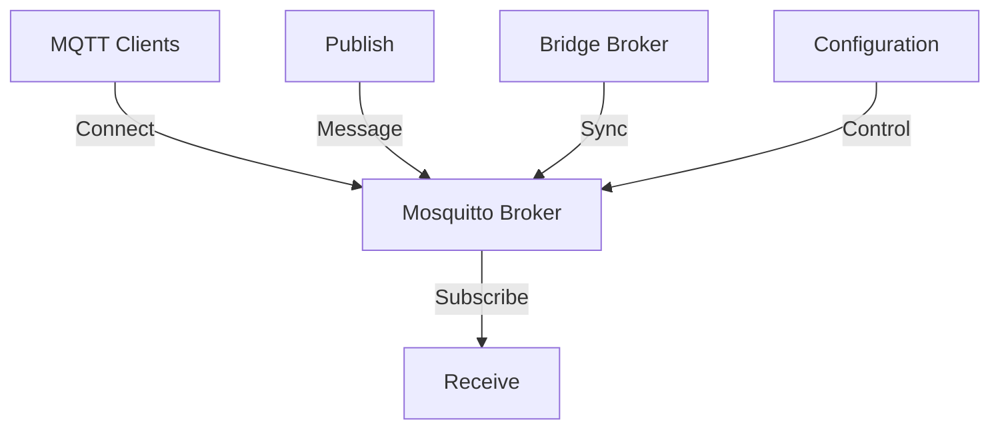

**Category:** Real-time & WebSocket Hosting
**Difficulty:** Intermediate
**Reading time:** 6 min read

---

Mosquitto is a lightweight open-source MQTT broker suitable for small to medium deployments. Deploying Mosquitto requires infrastructure management but provides full control and no licensing costs.

- **Open Source** — freely available, community-driven
- **Lightweight** — minimal resource requirements
- **Single Binary** — easy deployment and configuration
- **Plugin Architecture** — extending functionality
- **Bridge Mode** — connecting multiple brokers

Mosquitto is a standalone executable that can be deployed on any Linux/Unix system or containerized. Configuration files control port binding, authentication, logging, and persistence. Mosquitto stores retained messages and persistent sessions to disk by default. Multiple Mosquitto instances can bridge together for distributed deployments. Plugin support allows authentication backends and custom logic. TLS/SSL provides encrypted connections. Simple configuration makes setup straightforward but clustering for high availability requires additional infrastructure. Docker deployment simplifies containerization. Monitoring requires external tools like Prometheus.

- Development and testing environments
- Small scale IoT deployments
- Embedded system messaging
- Private network deployments
- Educational projects
- Home automation systems
- Prototyping

| Advantage | Disadvantage |
|-----------|--------------|
| Completely free and open source | No built-in clustering |
| Lightweight and efficient | Manual monitoring needed |
| Easy to deploy and configure | No commercial support |
| Full source code available | Scaling requires external tools |
| Active community support | High availability setup complex |

- [Self-hosted MQTT brokers](selfhosted-mqtt.md)
- [Mosquitto configuration guide](mosquitto-config.md)
- [MQTT broker comparison](mqtt-broker-comparison.md)

---
*Part of the [Real-time & WebSocket Hosting](real-time-websocket-hosting/index.md) category · [Back to Master Index](../../index.md)*
