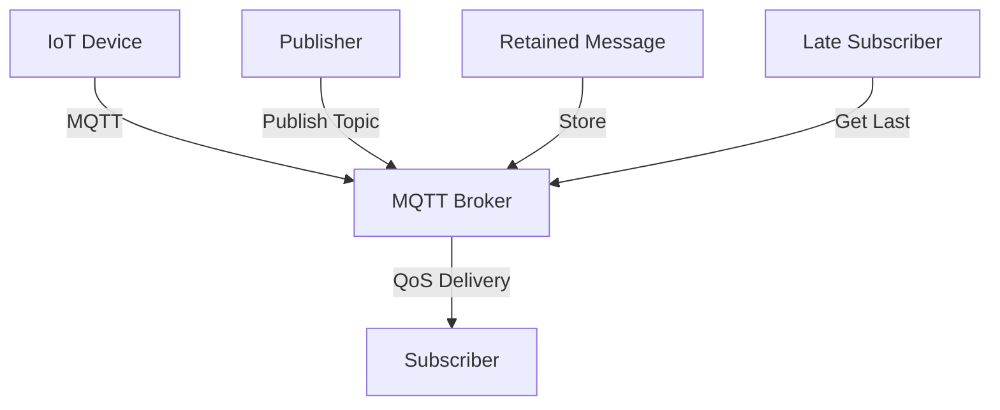

**Category:** Real-time & WebSocket Hosting
**Difficulty:** Intermediate
**Reading time:** 6 min read

---

MQTT is a lightweight publish-subscribe protocol optimized for IoT and mobile devices. Hosted MQTT brokers provide managed infrastructure for deploying MQTT networks at scale.

- **Lightweight Protocol** — minimal bandwidth and CPU overhead
- **Quality of Service** — three delivery guarantee levels (0, 1, 2)
- **Retained Messages** — storing last message for late subscribers
- **Topic Hierarchy** — organizing messages with hierarchical paths
- **Persistent Sessions** — delivering offline messages

MQTT brokers accept publisher connections and route messages to interested subscribers. Publishers send messages to topics without knowing subscribers. Brokers maintain topic subscriptions and deliver messages according to specified QoS levels. Quality 0 is fire-and-forget, Quality 1 guarantees at-least-once delivery, Quality 2 ensures exactly-once delivery. Retained messages store the last value for each topic. Persistent sessions preserve subscriptions across disconnections. Broker clustering enables horizontal scaling. MQTT is especially efficient for devices with limited connectivity, battery power, and bandwidth.

- IoT sensor data collection
- Home automation systems
- Industrial monitoring
- Vehicle telemetry
- Mobile app notifications
- Environmental monitoring
- Energy management systems

| Advantage | Disadvantage |
|-----------|--------------|
| Very lightweight protocol | Less feature-rich than alternatives |
| Battery efficient for IoT | Complex QoS semantics |
| Good for unreliable networks | Unidirectional messaging |
| Proven, mature technology | Limited to publish-subscribe |
| Excellent device compatibility | Requires MQTT client libraries |

- [IoT messaging protocols](iot-protocols.md)
- [QoS delivery guarantees](qos-guarantees.md)
- [Broker clustering](broker-clustering.md)

---
*Part of the [Real-time & WebSocket Hosting](real-time-websocket-hosting/index.md) category · [Back to Master Index](../../index.md)*
