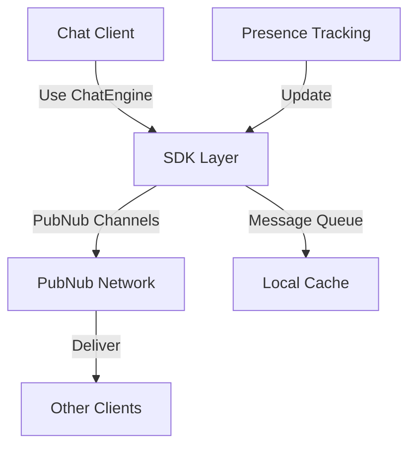

**Category:** Real-time & WebSocket Hosting
**Difficulty:** Intermediate
**Reading time:** 6 min read

---

ChatEngine SDK is a specialized library built on PubNub providing higher-level chat abstractions like conversations, typing indicators, and user lists. It accelerates development of messaging features.

- **Conversation Management** — organizing chat into threads
- **Typing Indicators** — showing when users are typing
- **User Lists** — managing participant tracking
- **Message History** — accessing conversation archives
- **Custom Events** — extending beyond standard chat

ChatEngine abstracts PubNub's core messaging into chat-specific features. Conversations are mapped to PubNub channels with built-in typing indicator support. The SDK manages user lists through presence channels automatically. Messages are queued locally providing offline support. Typing indicators use metadata updates for efficiency. Custom events allow application-specific messaging beyond text. The SDK handles reconnection and message recovery transparently. Built-in moderation and filtering support enforce chat policies. The framework simplifies common chat patterns without requiring deep PubNub knowledge.

- In-app messaging systems
- Customer support chat
- Community forums
- Real-time collaboration chat
- Gaming team communication
- Interactive streaming chat
- Customer service agents

| Advantage | Disadvantage |
|-----------|--------------|
| Higher-level abstraction simplifies development | Less flexibility than raw PubNub |
| Typing indicators included | Tied to ChatEngine API design |
| Presence management automatic | Additional SDK overhead |
| Good for rapid prototyping | Limited customization options |
| Rich feature set out of box | Vendor lock-in to ChatEngine |

- [Chat application architecture](chat-architecture.md)
- [Typing indicator patterns](typing-indicators.md)
- [Conversation management](conversation-management.md)

---
*Part of the [Real-time & WebSocket Hosting](real-time-websocket-hosting/index.md) category · [Back to Master Index](../../index.md)*
