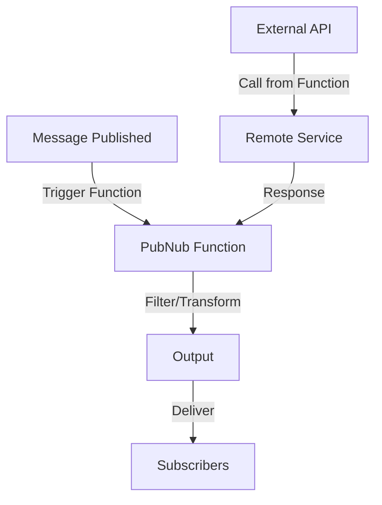

**Category:** Real-time & WebSocket Hosting
**Difficulty:** Intermediate
**Reading time:** 6 min read

---

PubNub Functions is a serverless compute platform integrated with PubNub's messaging network. It enables executing custom code triggered by messages without managing infrastructure.

- **Event Handlers** — code triggered by channel events
- **Message Filtering** — processing before delivery to subscribers
- **Request/Response** — handling external API calls
- **Serverless Execution** — no infrastructure management
- **Environment Variables** — secure configuration storage

Developers write functions in JavaScript that execute on PubNub's infrastructure. Functions are triggered by message publication events on specific channels. They can filter, transform, or enrich messages before delivery. Functions have access to PubNub APIs for publishing additional messages or querying metadata. External API calls integrate third-party services. Environment variables store secrets securely. Functions execute with strict timeouts preventing resource exhaustion. Multiple functions can execute sequentially in pipeline patterns. Deployment is automatic with version management. Functions provide lightweight server-side logic without container management.

- Message validation and filtering
- Data transformation pipelines
- Third-party service integration
- Content moderation automation
- Real-time analytics processing
- Authentication and authorization
- Message enrichment workflows

| Advantage | Disadvantage |
|-----------|--------------|
| No infrastructure management | Vendor lock-in to PubNub |
| Integrated with messaging | Execution time limits |
| Easy deployment and versioning | Limited local debugging |
| Cost-effective for sporadic use | Cold start latency possible |
| Automatic scaling | Language limited to JavaScript |

- [Serverless functions](serverless-functions.md)
- [Message processing pipelines](message-pipelines.md)
- [Edge function execution](edge-functions.md)

---
*Part of the [Real-time & WebSocket Hosting](real-time-websocket-hosting/index.md) category · [Back to Master Index](../../index.md)*
