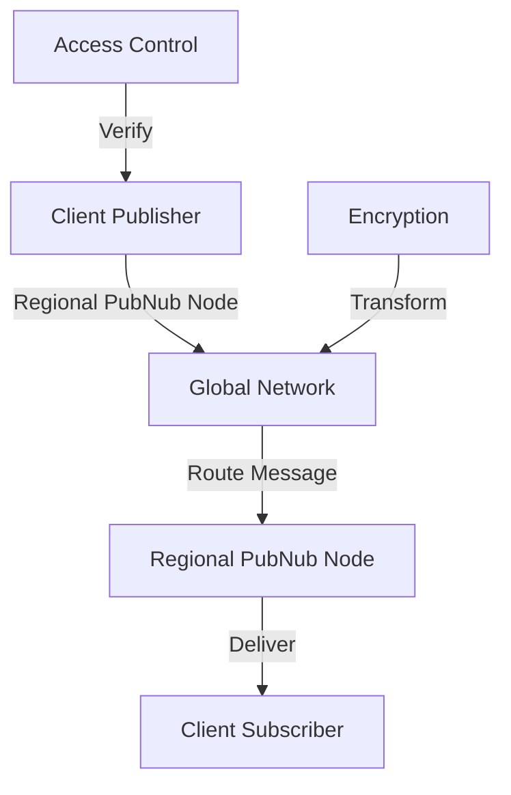

**Category:** Real-time & WebSocket Hosting
**Difficulty:** Intermediate
**Reading time:** 6 min read

---

PubNub is a global real-time messaging network providing low-latency pub/sub capabilities with added features like presence, storage, and functions. It serves millions of messages daily across a distributed infrastructure.

- **Global Edge Network** — worldwide distributed PubNub servers
- **Multi-Protocol Support** — supporting multiple transport protocols
- **Message Deduplication** — ensuring exactly-once delivery
- **Access Control** — granular permissions for channels and operations
- **Data Encryption** — end-to-end encryption capabilities

PubNub maintains points of presence across the globe, routing messages through the nearest edge nodes for low latency. Messages published to channels are distributed to subscribers with deduplication preventing duplicates. The network provides transparent failover to maintain availability. Encryption options protect message confidentiality in transit and at rest. Access control lists manage channel permissions and operation restrictions. The platform includes additional features like key-value storage for metadata and serverless functions for edge computation. Clients connect using WebSocket or HTTPS transports automatically selected for optimal performance.

- Real-time chat applications
- Live event streaming
- IoT sensor data distribution
- Multiplayer game networking
- Stock ticker services
- Collaborative tools
- Emergency alert systems

| Advantage | Disadvantage |
|-----------|--------------|
| Global low-latency infrastructure | Vendor lock-in |
| Rich feature set included | Pricing scales with messages |
| Excellent uptime and reliability | Learning curve for advanced features |
| Multiple protocol support | Message size limitations |
| Strong security features | Rate limiting applies |

- [Global CDN networks](global-cdn.md)
- [Edge computing platforms](edge-computing.md)
- [Real-time messaging patterns](realtime-patterns.md)

---
*Part of the [Real-time & WebSocket Hosting](real-time-websocket-hosting/index.md) category · [Back to Master Index](../../index.md)*
