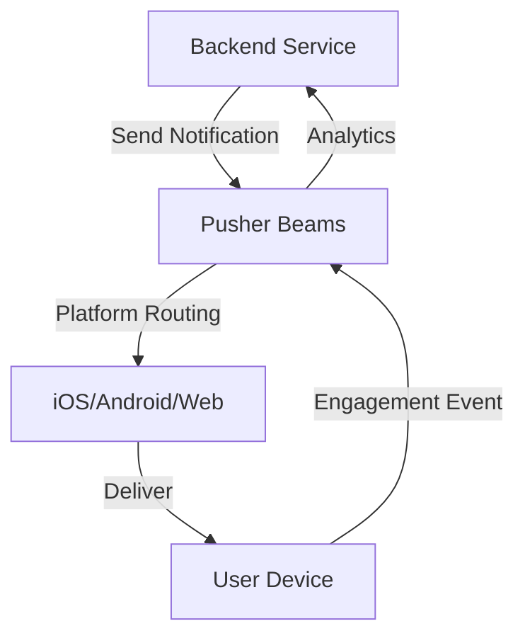

**Category:** Real-time & WebSocket Hosting
**Difficulty:** Intermediate
**Reading time:** 6 min read

---

Pusher Beams is a push notification platform that delivers messages to mobile devices and web clients. It integrates with Pusher's infrastructure for reliable, scalable notification delivery across multiple platforms.

- **Push Notifications** — messages delivered to devices even when app is closed
- **Device Targeting** — sending to specific devices or user groups
- **Interests** — categorical tagging for segmentation
- **Message Enrichment** — attaching data to push notifications
- **Delivery Analytics** — tracking notification engagement

Developers register devices with Pusher Beams, associating them with interests or user identifiers. The backend service publishes notifications to devices or interest groups. Pusher Beams handles platform differences, managing delivery through Apple Push Notification service, Firebase Cloud Messaging, and web push APIs. It deduplicates messages, handles offline delivery, and retries failed deliveries. Analytics track delivery success, open rates, and engagement. The system provides audience segmentation, scheduling, and A/B testing capabilities for notification campaigns.

- Mobile app notifications
- Critical system alerts
- Marketing campaigns
- User engagement features
- Event-triggered notifications
- Scheduled announcements
- Chat and messaging indicators

| Advantage | Disadvantage |
|-----------|--------------|
| Multi-platform support simplified | Platform-specific limitations |
| Automatic retry and delivery guarantee | Limited customization options |
| Integrated with Pusher ecosystem | Privacy considerations for mobile |
| Good analytics and tracking | Complex compliance requirements |
| Audience segmentation built-in | User opt-in management needed |

- [Push notification protocols](push-notification-protocols.md)
- [Device targeting strategies](device-targeting.md)
- [Notification delivery systems](notification-delivery.md)

---
*Part of the [Real-time & WebSocket Hosting](real-time-websocket-hosting/index.md) category · [Back to Master Index](../../index.md)*
