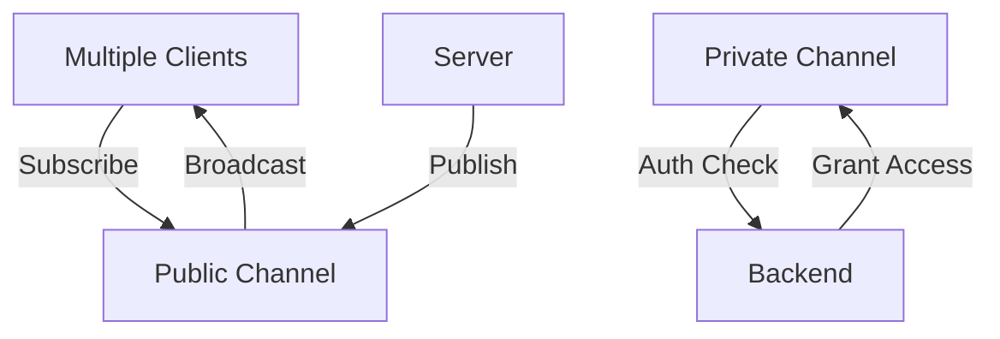

**Category:** Real-time & WebSocket Hosting
**Difficulty:** Intermediate
**Reading time:** 6 min read

---

Pusher Channels is the core real-time messaging platform enabling developers to build live features into applications. It provides a simple pub/sub model for broadcasting messages to groups of connected clients.

- **Public Channels** — accessible to any connected client
- **Private Channels** — require authentication and authorization
- **Presence Channels** — track active users and their metadata
- **Subscription** — client registration to receive channel messages
- **Broadcasting** — sending messages to all subscribers

Channels provide a publish-subscribe messaging system where clients subscribe to channel names and servers publish events. Public channels accept all connections while private channels require backend authentication. Presence channels additionally maintain member lists and user state. When a server publishes an event to a channel, Pusher routes it to all subscribed clients in real-time. Channel names support wildcards for hierarchical organization. The system handles subscription conflicts, connection management, and ensures message ordering within a channel.

- Multi-user collaboration features
- Live chat room systems
- Real-time data synchronization
- Broadcast announcements
- Live event notifications
- User activity feeds
- Interactive dashboard updates

| Advantage | Disadvantage |
|-----------|--------------|
| Simple pub/sub model easy to understand | Limited message persistence |
| Built-in private channel security | Bandwidth charged per message |
| Wildcard subscriptions for flexibility | Complex presence logic needed |
| Low latency global delivery | No built-in message ordering guarantees |
| Automatic scaling handled | Limited offline message queuing |

- [Pub/Sub messaging patterns](pub-sub-patterns.md)
- [Channel security](channel-security.md)
- [Presence systems](presence-systems.md)

---
*Part of the [Real-time & WebSocket Hosting](real-time-websocket-hosting/index.md) category · [Back to Master Index](../../index.md)*
