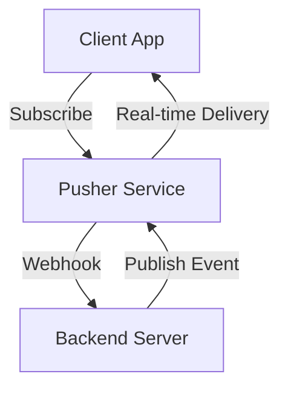

**Category:** Real-time & WebSocket Hosting
**Difficulty:** Intermediate
**Reading time:** 6 min read

---

Pusher is a hosted real-time messaging service that enables low-latency, bidirectional communication between servers and clients. It abstracts away WebSocket complexity and provides built-in features for authentication, presence, and message delivery.

- **Channels** — logical message topics that clients subscribe to
- **Events** — named messages published to channels
- **Presence** — tracking which users are online and their state
- **Authentication** — verifying channel access permissions
- **Webhooks** — server-side event notifications from Pusher

Pusher maintains persistent WebSocket connections from clients to its distributed service. Backend servers publish events to specific channels using REST APIs or SDKs. Pusher routes messages to all subscribed clients in real-time. The service handles connection management, automatic reconnection, and message delivery guarantees. Presence features track user state across channels. Webhooks notify backends of connection events and custom triggers. Pusher abstracts infrastructure scaling, allowing developers to focus on application logic without managing WebSocket servers.

- Live chat and messaging
- Real-time notifications
- Activity feeds
- Collaborative typing indicators
- Live data dashboards
- Gaming multiplayer features
- Auction and bidding systems

| Advantage | Disadvantage |
|-----------|--------------|
| Fully managed service reduces ops burden | Vendor lock-in risk |
| Built-in presence and authentication | Pricing scales with message volume |
| Global distribution with low latency | Rate limits on message throughput |
| Excellent SDKs and documentation | Not suitable for extremely high volume |
| Enterprise features included | Privacy concerns with hosted data |

- [WebSocket fundamentals](websocket-fundamentals.md)
- [Real-time architectures](real-time-architectures.md)
- [Message delivery patterns](message-delivery-patterns.md)

---
*Part of the [Real-time & WebSocket Hosting](real-time-websocket-hosting/index.md) category · [Back to Master Index](../../index.md)*
