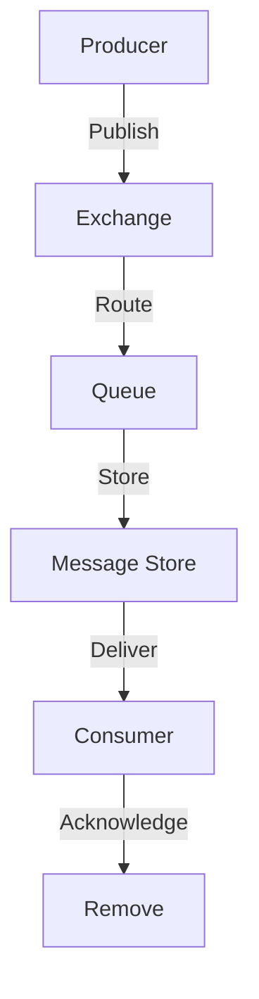

**Category:** Real-time & WebSocket Hosting
**Difficulty:** Intermediate
**Reading time:** 6 min read

---

RabbitMQ is an open-source message broker implementing AMQP protocol. It provides reliable message delivery with complex routing and is ideal for enterprise messaging needs.

- **Durable Queues** — persistent message storage
- **Exchanges** — flexible message routing
- **Bindings** — connecting exchanges to queues
- **Dead Letter Queues** — handling failed messages
- **Acknowledgments** — reliability guarantees

RabbitMQ provides durable message queue infrastructure with multiple delivery patterns. Producers publish messages to exchanges which route them to queues based on bindings. Queues persistently store messages to disk. Consumers pull messages from queues and acknowledge receipt. Dead letter exchanges handle messages that exceed delivery attempts. RabbitMQ ensures no message is lost even during failures. Various exchange types (direct, topic, fanout) support different routing patterns. Consumer groups process messages in parallel. Clustering provides high availability. Priority queues and policies enable complex patterns.

- Task queue systems
- Asynchronous job processing
- Email delivery systems
- Order processing pipelines
- Payment processing queues
- Log aggregation
- Microservice communication

| Advantage | Disadvantage |
|-----------|--------------|
| Guaranteed reliable delivery | More complex than simple alternatives |
| Flexible routing patterns | Higher resource requirements |
| Durable message storage | Steeper learning curve |
| Well-tested and proven | Operational complexity |
| Excellent documentation | Performance overhead vs direct calls |

- [Message queue architectures](message-queue-architecture.md)
- [AMQP protocol details](amqp-protocol.md)
- [Asynchronous job processing](async-jobs.md)

---
*Part of the [Real-time & WebSocket Hosting](real-time-websocket-hosting/index.md) category · [Back to Master Index](../../index.md)*
