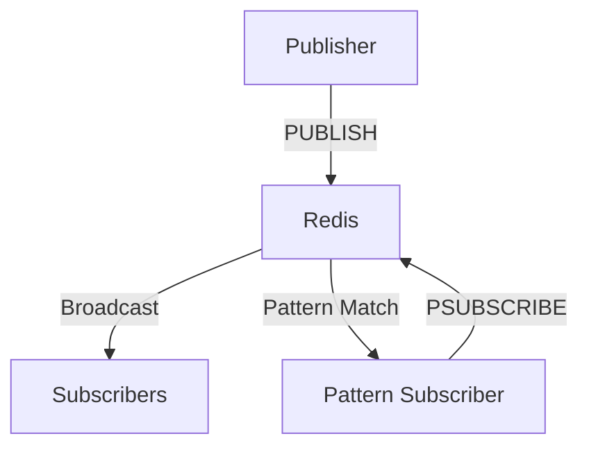

**Category:** Real-time & WebSocket Hosting
**Difficulty:** Intermediate
**Reading time:** 6 min read

---

Redis Pub/Sub is a messaging system built into Redis for real-time message broadcasting. Hosted Redis services provide managed Pub/Sub for applications needing simple, fast messaging.

- **In-Memory Messaging** — fast, non-persistent by default
- **Simple API** — publish and subscribe commands
- **Pattern Subscriptions** — subscribing to topic patterns
- **Broadcast Model** — all subscribers receive all messages
- **No Durability** — messages lost if no subscribers

Redis Pub/Sub operates in-memory for extremely fast message delivery. Publishers send messages to channel names using the PUBLISH command. Subscribers receive messages matching their subscriptions. Pattern subscriptions allow wildcard matching on channel names. All subscribers receive all messages published to channels they subscribe to. Messages are not persisted unless using Redis Streams. Connections are maintained as long as subscriptions exist. The system has no message queue or delivery guarantees, making it suitable for non-critical messaging. Redis Streams provide durable alternative when persistence is needed.

- Real-time notifications
- Cache invalidation signals
- Live dashboard updates
- Activity feed distribution
- WebSocket gateway messages
- Task distribution
- Event notification systems

| Advantage | Disadvantage |
|-----------|--------------|
| Extremely fast and simple | No message persistence |
| Low latency messaging | No delivery guarantees |
| Easy to implement | Subscribers must be online |
| Minimal overhead | Not suitable for critical messaging |
| Great for high-frequency data | Limited to in-memory data size |

- [Redis Streams durability](redis-streams.md)
- [Pub/Sub alternatives](pubsub-alternatives.md)
- [Real-time messaging trade-offs](messaging-tradeoffs.md)

---
*Part of the [Real-time & WebSocket Hosting](real-time-websocket-hosting/index.md) category · [Back to Master Index](../../index.md)*
