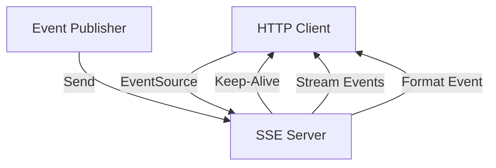

**Category:** Real-time & WebSocket Hosting
**Difficulty:** Intermediate
**Reading time:** 6 min read

---

Server-Sent Events provides a simpler alternative to WebSocket for server-to-client messaging using standard HTTP. SSE hosting services manage the infrastructure for reliable event streaming.

- **One-Way Streaming** — server pushes to client, unidirectional
- **Automatic Reconnection** — client automatically reconnects on disconnect
- **Event Types** — categorizing different message types
- **Retry Management** — configurable reconnection delays
- **Standard HTTP** — no special protocol, uses EventSource API

SSE hosting providers manage HTTP servers that maintain long-lived connections to clients. Clients open an EventSource connection to a server endpoint. The server sends events formatted as text streams. Each event includes optional type, data, and ID fields. Clients automatically reconnect with exponential backoff on disconnection. Event IDs allow server-side tracking of delivered messages. The connection uses standard HTTP/HTTPS reducing complexity. Server-side code is simpler than WebSocket handling. However, SSE is unidirectional requiring separate channels for client-to-server messaging. Load balancing must maintain sticky sessions to prevent message duplication.

- Real-time notifications
- Live log streaming
- Sports score updates
- Stock ticker feeds
- Server status monitoring
- Social media feeds
- Push notification backends

| Advantage | Disadvantage |
|-----------|--------------|
| Simpler than WebSocket | Unidirectional only |
| Uses standard HTTP | More connections than WebSocket |
| Automatic client reconnection | Limited by HTTP protocol limits |
| Works through proxies well | Event size limitations |
| Good browser compatibility | No binary protocol support |

- [Server push technologies](server-push.md)
- **WebSocket comparison**
- [Real-time protocol comparison](realtime-protocol-comparison.md)

---
*Part of the [Real-time & WebSocket Hosting](real-time-websocket-hosting/index.md) category · [Back to Master Index](../../index.md)*
