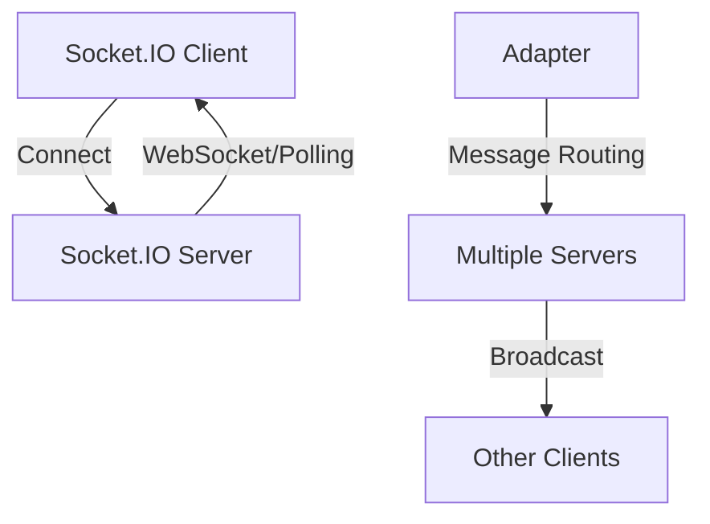

**Category:** Real-time & WebSocket Hosting
**Difficulty:** Intermediate
**Reading time:** 6 min read

---

Socket.IO is a popular real-time communication library providing WebSocket abstraction with fallbacks. Hosting solutions for Socket.IO manage infrastructure, scaling, and deployment challenges.

- **WebSocket Fallback** — automatic downgrade to HTTP long-polling
- **Binary Protocol** — efficient Socket.IO binary message format
- **Rooms and Namespaces** — organizing connections into groups
- **Event-Based API** — simple emit/on message pattern
- **Adapter Pattern** — enabling horizontal scaling across servers

Socket.IO hosting providers manage Node.js servers running Socket.IO applications. They handle WebSocket connection management and HTTP polling fallbacks for incompatible clients. Adapters enable message distribution across multiple server instances for scaling. Sticky session routing ensures clients reconnect to the same server instance. The hosting platform handles load balancing, auto-scaling, and deployment. Managed databases store session state for recovery after failures. Providers offer monitoring, logging, and debugging tools. Most solutions support both cloud VMs and containerized deployments.

- Real-time web applications
- Collaborative tools
- Live dashboards
- Multiplayer games
- Chat applications
- Notification systems
- Live editing tools

| Advantage | Disadvantage |
|-----------|--------------|
| Mature, well-documented library | Tied to Node.js ecosystem |
| Good browser compatibility | Scaling complexity with adapters |
| Rich ecosystem of middleware | Legacy fallback overhead |
| Easy to learn and use | Not as efficient as native WebSocket |
| Good developer experience | Vendor lock-in for managed services |

- [WebSocket protocols](websocket-protocols.md)
- [Real-time library comparison](realtime-library-comparison.md)
- [Connection management patterns](connection-management.md)

---
*Part of the [Real-time & WebSocket Hosting](real-time-websocket-hosting/index.md) category · [Back to Master Index](../../index.md)*
