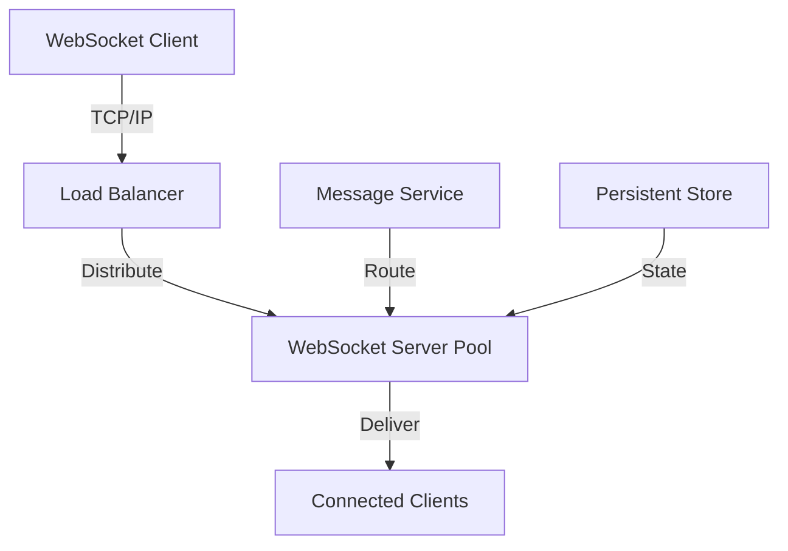

**Category:** Real-time & WebSocket Hosting
**Difficulty:** Intermediate
**Reading time:** 6 min read

---

WebSocket server hosting services provide managed infrastructure for deploying custom WebSocket applications. They handle scaling, connection management, and infrastructure challenges automatically.

- **Connection Pooling** — managing thousands of concurrent connections
- **Memory Management** — efficient handling of connection state
- **Load Balancing** — distributing connections across server instances
- **Message Routing** — directing messages between clients
- **Graceful Shutdown** — handling server restarts without connection loss

WebSocket hosting platforms provide servers optimized for long-lived connections. Load balancers distribute incoming WebSocket connections across server instances. Sticky sessions maintain client affinity to specific servers. In-memory databases like Redis maintain shared state for routing messages across servers. Connection pooling efficiently manages system resources allowing high client counts. Message brokers route messages from publishers to interested subscribers. Monitoring systems track connection health and performance. Auto-scaling provisions additional servers during demand spikes. Graceful shutdown drains connections avoiding message loss.

- Custom real-time applications
- Game server infrastructure
- Live streaming backends
- Real-time analytics platforms
- IoT communication hubs
- Financial trading systems
- Collaborative applications

| Advantage | Disadvantage |
|-----------|--------------|
| Full control over implementation | Complex operational burden |
| Custom messaging protocols | Requires infrastructure expertise |
| Optimized for specific use case | Higher operational costs |
| No vendor constraints | Scaling challenges at large scale |
| Custom authentication logic | Requires careful monitoring |

- [WebSocket architecture patterns](websocket-patterns.md)
- [Connection state management](connection-state.md)
- [Message routing systems](message-routing.md)

---
*Part of the [Real-time & WebSocket Hosting](real-time-websocket-hosting/index.md) category · [Back to Master Index](../../index.md)*
