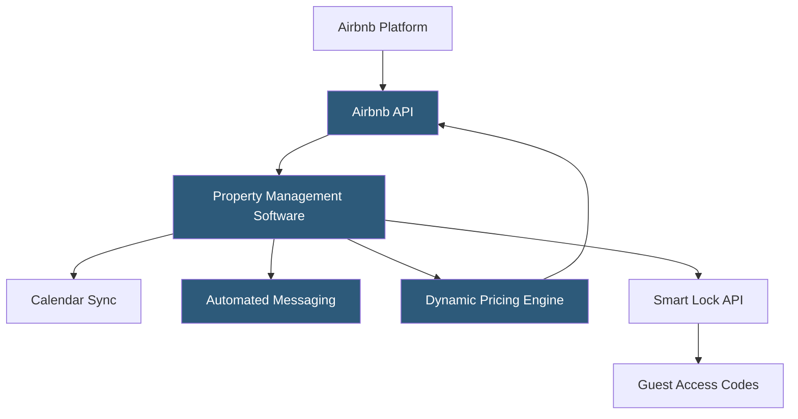

**Category:** Restaurant & Hospitality Hosting
**Difficulty:** Beginner
**Reading time:** 5 min read

---

Airbnb property management encompasses the tools, integrations, and practices professional hosts and property managers use to operate short-term rental listings on Airbnb at scale. Purpose-built property management software (PMS) connects to Airbnb via its official API to synchronize calendars, pricing, messaging, and reservations across multiple listings and additional platforms.

- **Airbnb API** — the official integration interface enabling certified PMS and channel manager platforms to manage listings programmatically
- **iCal Sync** — a basic calendar synchronization method using the iCalendar format, used when API access is unavailable
- **Dynamic Pricing** — automated rate adjustments based on demand, seasonality, and local events using tools like PriceLabs or Beyond
- **Unified Inbox** — a centralized messaging interface in PMS software consolidating Airbnb, VRBO, and direct booking messages
- **Automated Messaging** — pre-configured message templates triggered at booking confirmation, pre-arrival, check-in, and checkout
- **Smart Lock Integration** — automated PIN code generation and delivery to guests based on reservation dates
- **Multi-Platform Listing** — managing the same property simultaneously on Airbnb, VRBO, Booking.com, and direct channels

Professional Airbnb hosts managing multiple properties connect their listings to a vacation rental PMS (Guesty, Hostfully, Lodgify, OwnerRez) using Airbnb's official API. This connection enables two-way data flow: the PMS pushes availability and pricing updates to Airbnb, and Airbnb pushes new reservation data to the PMS.

Calendar synchronization is the foundation of multi-platform management. When a guest books on VRBO, the PMS immediately blocks those dates in the Airbnb calendar through the API. This prevents double bookings across platforms. The underlying mechanism uses an availability hold with reservation-level detail preserved for each platform.

Dynamic pricing tools (PriceLabs, Beyond, Wheelhouse) connect to the Airbnb listing via API and analyze market demand signals—local events, competitor pricing, historical booking pace—to recommend nightly rate changes. These tools push recommended rates to Airbnb multiple times per day, optimizing revenue without manual oversight.

Automated messaging flows trigger on reservation events. At booking confirmation, a customized welcome message with house rules and check-in instructions sends automatically. 24 hours before arrival, a final check-in reminder with the smart lock code (generated automatically based on the reservation dates) delivers to the guest. Post-checkout, a review reminder sends with a link to the property's direct booking page.

Cleaning management integrates with services like Properly or TurnoverBnB, which receive checkout notifications from the PMS and automatically schedule cleaning crews and update room readiness status.

- Multi-property hosts managing 5–500 listings across platforms
- Co-hosts managing properties on behalf of homeowners
- Vacation rental managers seeking to automate guest communication
- Hosts running direct booking websites alongside Airbnb
- Property managers using dynamic pricing to maximize seasonal revenue

| Advantage                                       | Disadvantage                                                   |
| ----------------------------------------------- | -------------------------------------------------------------- |
| Automation reduces per-listing management time  | Airbnb algorithm rewards direct-platform engagement            |
| Multi-platform distribution increases occupancy | API access requires meeting Airbnb's connectivity requirements |
| Dynamic pricing increases revenue by 10–40%     | Third-party tools add subscription costs per listing           |
| Smart lock automation eliminates key handoff    | Technical setup requires initial learning curve                |

- [Guesty Vacation Rental Platform](guesty-vacation-rental-platform.md)
- [Hostfully Property Management](hostfully-property-management.md)
- [Hotel Booking Engine Hosting](hotel-booking-engine-hosting.md)

---
*Part of the [Restaurant & Hospitality Hosting](index.md) category · [Back to Master Index](../../index.md)*
