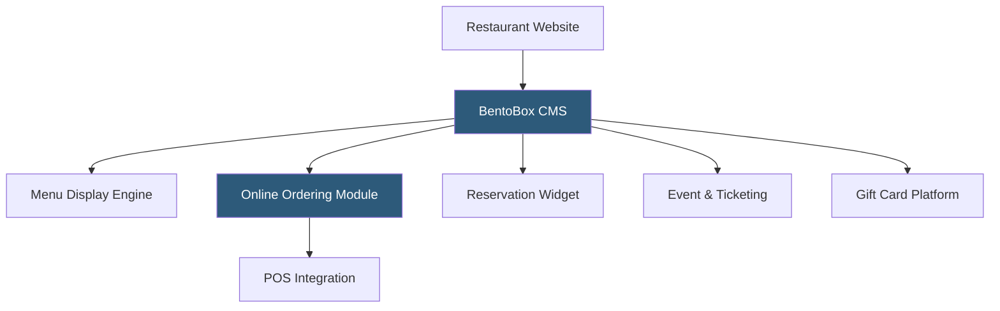

**Category:** Restaurant & Hospitality Hosting
**Difficulty:** Beginner
**Reading time:** 5 min read

---

BentoBox is a restaurant-specific website and marketing platform providing professionally designed websites with built-in online ordering, reservations, event ticketing, and catering management. Unlike generic website builders, BentoBox templates are optimized for the restaurant industry's specific needs: menu display, reservation widgets, photo galleries, and gift card sales are built in rather than bolted on.

- **Restaurant-Specific CMS** — Content management system with restaurant-specific content types: menus, locations, press, events
- **Integrated Online Ordering** — Commission-free direct ordering built into the website, not an embedded third-party widget
- **Event & Ticket Sales** — Hosted ticketing for special dinners, cooking classes, and private events
- **Catering Management** — Dedicated catering inquiry and order workflow separate from regular ordering
- **Gift Card Sales** — Integrated digital and physical gift card platform
- **Multi-Location Management** — Single platform managing websites for multiple restaurant locations under one account

BentoBox provides restaurants a hosted website built on the BentoBox platform, eliminating the need to engage a web developer for ongoing updates. Restaurants manage content through a purpose-built CMS with food-industry content types: adding a new menu item, updating hours, posting a press mention, or announcing a private event are all handled through guided interfaces without coding.

The online ordering module processes orders commission-free, with revenue going directly to the restaurant minus a small processing fee. Orders integrate with Toast POS and other supported systems. The event module handles seating, ticketing (with custom ticket quantities and pricing tiers), and attendance tracking for special dinners, wine tastings, and cooking classes — revenue streams beyond regular dining service.

BentoBox acquired Fiserv's Clover Online Ordering and integrated digital commerce capabilities. The platform's SEO tools are optimized for restaurant-specific search queries — neighborhood dining searches, cuisine type discovery, and reservation intent queries — driving organic traffic to the restaurant's own site rather than third-party platforms.

- Independent restaurants wanting professional web presence without web development costs
- Operators running regular special events or ticketed experiences
- Restaurants building catering revenue streams with dedicated inquiry workflows
- Groups managing multiple location websites with consistent branding
- Operators wanting gift card sales without a separate third-party platform

| Advantage | Disadvantage |
|-----------|--------------|
| Restaurant-specific features built in, not added on | Less customization flexibility than custom-built websites |
| Commission-free ordering integrated in the website | Monthly subscription cost for all platform features |
| Handles events, catering, and gift cards in one platform | Smaller community and template library than generic builders |
| SEO optimized for restaurant-specific search intent | Migration away from the platform requires rebuilding site |

- [ChowNow Online Ordering](chownow-online-ordering.md)
- [Popmenu Digital Menu Platform](popmenu-digital-menu-platform.md)
- [Restaurant Marketing Automation](restaurant-marketing-automation.md)

---
*Part of the [Restaurant & Hospitality Hosting](index.md) category · [Back to Master Index](../../index.md)*
