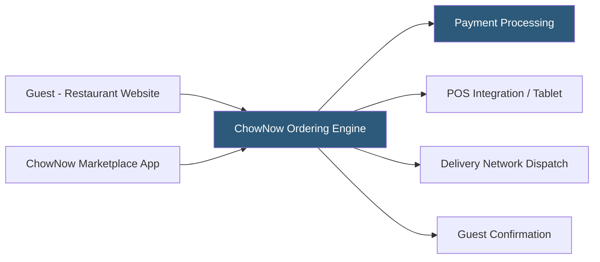

**Category:** Restaurant & Hospitality Hosting
**Difficulty:** Beginner
**Reading time:** 5 min read

---

ChowNow is a commission-free online ordering platform that provides independent restaurants with branded ordering experiences without ongoing per-order fees. ChowNow charges a flat monthly subscription, making cost predictable regardless of order volume. The platform also operates a consumer marketplace app and integrates with major delivery networks, giving restaurants both direct and discovery ordering channels.

- **Commission-Free Model** — Flat monthly fee replaces per-order percentage commissions
- **Branded Ordering** — Restaurant-branded ordering pages and mobile apps maintaining operator identity
- **ChowNow Marketplace App** — Consumer discovery app aggregating ChowNow restaurants for new guest acquisition
- **Delivery Network Integration** — Connections to DoorDash Drive, Relay, and other DSPs for last-mile fulfillment
- **POS Integration** — Direct injection into supported POS systems via API or tablet-based middleware
- **ChowNow Dashboard** — Analytics portal showing order volume, revenue, item performance, and customer data

ChowNow provides restaurants a hosted ordering widget embedded in their existing website, or a standalone ordering page hosted by ChowNow. The ordering experience is branded with the restaurant's logo, colors, and photography, avoiding the generic marketplace appearance of third-party platforms. Orders route through ChowNow's processing infrastructure and are delivered to the restaurant via POS API integration, a tablet running the ChowNow app, or email/fax for restaurants without integration options.

Delivery is facilitated through ChowNow's partnerships with delivery service providers — the restaurant does not need to join DoorDash or Uber Eats to access delivery drivers. ChowNow dispatches through its network, and the driver cost is either absorbed into menu pricing or charged as a delivery fee to the guest, but no commission goes to ChowNow.

The ChowNow Marketplace app provides a discovery channel where new diners find restaurants they haven't ordered from before, supplementing the direct traffic to the restaurant's own website. Customer contact data from all orders belongs to the restaurant, enabling direct email marketing campaigns.

- Independent restaurants wanting to eliminate third-party commissions
- Operators who have been absorbing high-commission platform fees
- Restaurants with existing website traffic wanting to capture direct orders
- Ghost kitchens needing delivery coordination without marketplace contracts
- Multi-location independent groups building a branded ordering presence

| Advantage | Disadvantage |
|-----------|--------------|
| Predictable flat-fee subscription replaces variable commissions | Requires marketing investment to drive traffic to direct channel |
| Restaurant owns all customer contact data | Marketplace app has far smaller user base than DoorDash or Uber Eats |
| Branded experience maintains restaurant identity | POS integration depth varies by system |
| Delivery network access without marketplace dependency | Monthly fee is a fixed cost even during slow periods |

- [Online Ordering Platform Hosting](online-ordering-platform-hosting.md)
- [Toast Online Ordering](toast-online-ordering.md)
- [BentoBox Restaurant Websites](bentobox-restaurant-websites.md)

---
*Part of the [Restaurant & Hospitality Hosting](index.md) category · [Back to Master Index](../../index.md)*
