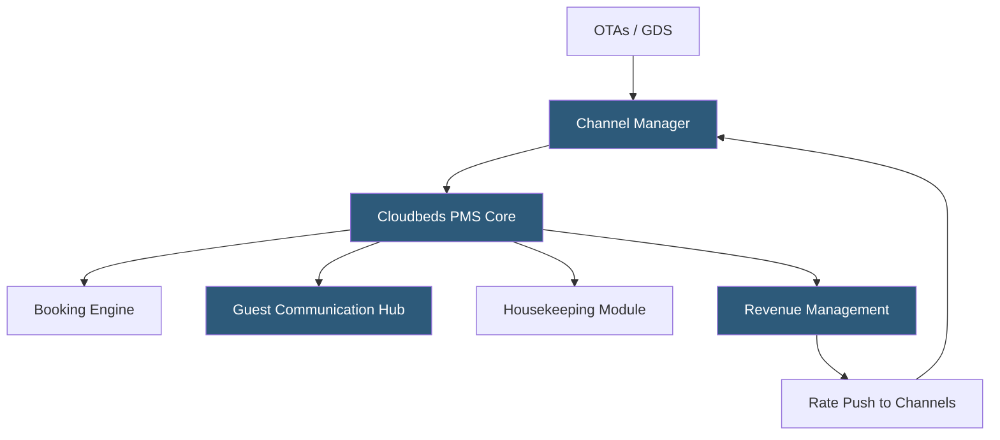

**Category:** Restaurant & Hospitality Hosting
**Difficulty:** Intermediate
**Reading time:** 6 min read

---

Cloudbeds is a cloud-native hospitality management platform combining PMS, channel manager, booking engine, and revenue management in a single SaaS product. It targets independent hotels, hostels, bed-and-breakfasts, vacation rentals, and boutique properties that need enterprise-grade distribution without the complexity or cost of legacy systems like Opera.

- **Unified Inbox** — a centralized messaging hub aggregating guest communications from OTAs, email, SMS, and WhatsApp
- **Channel Manager** — Cloudbeds' built-in distribution layer connecting to 300+ OTAs and GDS channels
- **Booking Engine** — a white-labeled direct booking widget embedded on the property's website
- **mPOS** — mobile point-of-sale functionality for charging guests at poolside, restaurant, or remote locations
- **Revenue Optimization** — the Cloudbeds Intelligence module providing occupancy-based rate recommendations
- **PMS API** — Cloudbeds' REST API enabling third-party integrations with lock systems, spa software, and POS
- **Multi-Property** — centralized dashboard management for groups owning multiple properties under one account

Cloudbeds operates as a single-stack SaaS application, meaning the PMS, channel manager, and booking engine share a common database and event bus rather than being separate products integrated via API. This architecture ensures that a rate change in the PMS propagates instantly to all connected distribution channels without the 15–30 minute delays common in multi-vendor architectures.

The channel manager maintains two-way XML or API connections with OTAs using ARI (Availability, Rates, Inventory) protocols. When a guest books on Booking.com, the OTA sends a reservation notification to Cloudbeds, which creates the reservation in the PMS and simultaneously reduces inventory across all other channels to prevent double booking. The entire process typically completes in under five seconds.

The direct booking engine embeds as a JavaScript widget on any property website. It queries the Cloudbeds rate engine in real time, displaying available room types and rates. Guests complete booking through a PCI-compliant payment form; the reservation routes directly into the PMS without manual intervention.

Cloudbeds Intelligence analyzes historical occupancy, competitor rates (scraped from OTAs), and upcoming demand events to recommend rate adjustments. Property managers review recommendations in a dashboard and can auto-approve rules (e.g., "increase rates by 20% when occupancy exceeds 80%"). Rate changes push automatically to all channels.

Guest communications consolidate in the unified inbox, where automated pre-arrival, check-in, and post-stay messages are configured as templates with personalization tokens.

- Independent hotels replacing spreadsheet-based management
- Hostel operators managing dormitory bed-level inventory
- Vacation rental owners managing multi-unit properties
- Boutique hotel groups running 2–20 properties from one dashboard
- Properties launching direct booking to reduce OTA commission dependency

| Advantage | Disadvantage |
|-----------|--------------|
| All-in-one reduces vendor management overhead | Less enterprise depth than Oracle OPERA for large chains |
| Native channel manager eliminates sync delays | App marketplace smaller than some competitors |
| Affordable pricing for small to mid-size properties | Advanced revenue management requires add-on module |
| Rapid onboarding compared to legacy PMS | Limited customization vs. open-API platforms like Apaleo |

- [Hotel Property Management Systems (PMS)](hotel-property-management-systems-pms.md)
- [Mews Hotel Management](mews-hotel-management.md)
- [Hotel Channel Manager Hosting](hotel-channel-manager-hosting.md)

---
*Part of the [Restaurant & Hospitality Hosting](index.md) category · [Back to Master Index](../../index.md)*
