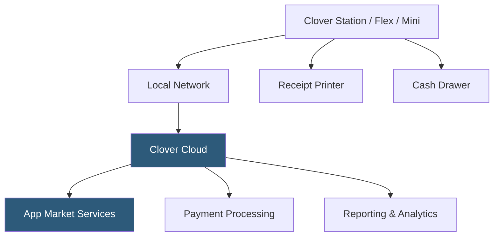

**Category:** Restaurant & Hospitality Hosting
**Difficulty:** Beginner
**Reading time:** 5 min read

---

Clover for Restaurants is a flexible POS platform distributed through banks and merchant acquirers, offering Android-based hardware with a customizable app marketplace. Unlike closed POS ecosystems, Clover's open platform allows restaurants to install third-party apps for specific functionality, adapting the system to unique operational needs. It is widely deployed across quick-service, full-service, and counter-service restaurant formats.

- **Clover App Market** — Curated marketplace of third-party apps extending Clover's functionality for loyalty, inventory, accounting, and more
- **Clover Dashboard** — Web-based management portal for menu configuration, reporting, and employee management
- **Clover Flex** — Handheld device for tableside ordering and payments, supporting EMV, NFC, and magstripe
- **Clover Mini** — Compact countertop terminal suitable for quick-service or bar environments
- **Merchant Acquirer Distribution** — Clover is sold through banks and ISOs, meaning payment processing terms vary by reseller
- **Revenue Protection** — Built-in tools for tip management, cash drawer reconciliation, and discount tracking

Clover hardware runs an Android-based operating system with Clover's proprietary POS software. Devices connect to Clover's cloud infrastructure over the restaurant's internet connection, synchronizing transaction data, menu changes, and employee records in real time. The Clover App Market allows operators to install specialized applications — examples include loyalty platforms like Loyalty Rewards, inventory management tools, and online ordering connectors — without replacing the core POS.

Menu management occurs through the Clover Dashboard web interface, with updates propagating to all connected devices within seconds. Payment processing is tightly integrated with the merchant's acquiring bank, meaning rates and settlement terms are negotiated separately from the hardware and software costs. Clover supports complex order modifications, table management through add-on apps, and kitchen printing or KDS routing.

Employee permissions, clock-in/clock-out, and tip management are handled natively. The platform's open API allows custom integrations beyond the App Market for businesses with development resources.

- Quick-service restaurants wanting extensible POS via an app marketplace
- Restaurants whose acquiring bank bundles Clover with merchant accounts
- Bars needing tab management with flexible payment splitting
- Multi-concept operators mixing QSR and FSR under one account
- Restaurants requiring specialized integrations not available on closed platforms

| Advantage | Disadvantage |
|-----------|--------------|
| Extensible app marketplace adapts to specific needs | Payment processing rates set by reselling bank, not Clover |
| Wide availability through bank distribution channels | App quality varies significantly across the marketplace |
| Supports diverse hardware form factors | Less unified experience than vertically integrated platforms |
| Open API for custom development | Support quality depends on the selling merchant acquirer |

- [Square for Restaurants](square-for-restaurants.md)
- [Toast POS Restaurant Platform](toast-pos-restaurant-platform.md)
- [Lightspeed Restaurant POS](lightspeed-restaurant-pos.md)

---
*Part of the [Restaurant & Hospitality Hosting](index.md) category · [Back to Master Index](../../index.md)*
