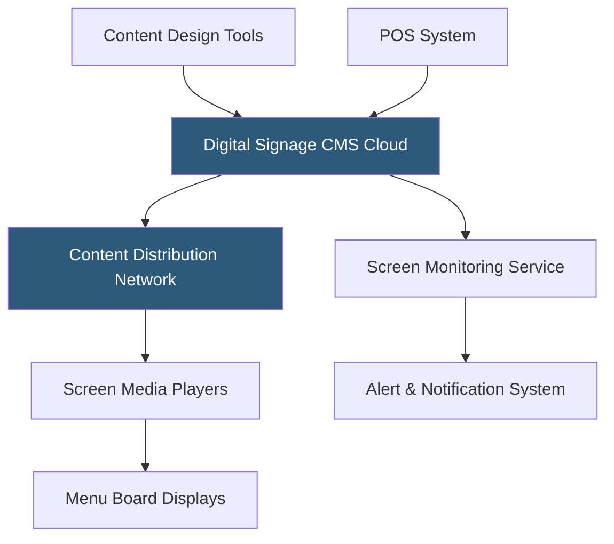

**Category:** Restaurant & Hospitality Hosting
**Difficulty:** Intermediate
**Reading time:** 6 min read

---

Digital menu board hosting encompasses the cloud infrastructure that manages content displayed on screen-based menu signs in restaurants. Unlike static printed menus, digital menu boards update in real time and can display dynamic pricing, promotional content, daypart scheduling, and calorie information. The hosting platform manages content scheduling, screen monitoring, emergency updates, and integration with POS systems for automatic sold-out flagging.

- **Digital Signage CMS** — Cloud content management system for creating, scheduling, and publishing menu board content to screens
- **Screen Management** — Remote monitoring and control of individual display screens, including status, temperature, and content version
- **Daypart Scheduling** — Automatic content transitions between breakfast, lunch, dinner, and late-night menus on defined schedules
- **POS Integration** — Real-time data feed from the POS to remove sold-out items from displayed menus automatically
- **Dynamic Pricing** — Rule-based price updates pushed to screens without manual redesign of board layouts
- **Failsafe Content** — Locally cached content that continues displaying if cloud connectivity is lost

Digital menu board systems consist of three layers: the cloud CMS where content is authored and scheduled, the distribution network that pushes content to locations, and the on-premise media players connected to displays. The media players are typically compact computing devices (Intel NUC, BrightSign, Chrome OS devices, or smart commercial displays) that receive content packages from the cloud and play them locally.

Content creation tools allow non-technical staff to build menu board layouts from templates, drag-and-drop menu items, and schedule transitions. Published content pushes to screens via internet connection; most systems cache the current content locally so screens continue displaying even if the internet connection drops. The CMS tracks each screen's status, alerting operations teams when a player goes offline, overheats, or falls behind on content versions.

POS integration enables the most operationally valuable feature: when a menu item is marked 86'd in the POS, a webhook triggers the menu board CMS to automatically remove or gray out that item on all applicable screens within seconds. This eliminates guest disappointment from ordering items displayed that are unavailable.

- QSR chains updating prices and promotions without manual sign replacement
- Multi-location operators pushing synchronized promotional campaigns simultaneously
- Drive-through lanes with weatherproof outdoor displays
- Food courts and cafeterias with high menu complexity
- Stadium concessions needing rapid sold-out notifications across many points of sale

| Advantage | Disadvantage |
|-----------|--------------|
| Real-time updates without physical sign replacement | Higher upfront cost than static signage |
| Automatic POS-driven sold-out management | Requires reliable internet for remote management |
| Centralized multi-location content management | Media player hardware requires maintenance and eventual replacement |
| Dynamic daypart scheduling reduces manual labor | Content authoring requires design skill or template investment |

- [Restaurant Menu Management](restaurant-menu-management.md)
- [Kitchen Display System (KDS) Cloud](kitchen-display-system-kds-cloud.md)
- [Toast POS Restaurant Platform](toast-pos-restaurant-platform.md)

---
*Part of the [Restaurant & Hospitality Hosting](index.md) category · [Back to Master Index](../../index.md)*
