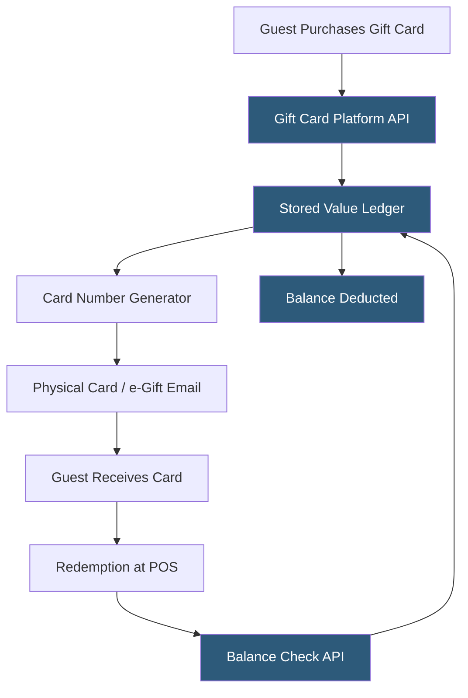

**Category:** Restaurant & Hospitality Hosting
**Difficulty:** Intermediate
**Reading time:** 6 min read

---

Gift card management systems handle the full lifecycle of restaurant gift cards—from issuance and activation to balance tracking and redemption—through cloud-hosted platforms integrated with POS systems. They support both physical plastic cards and digital e-gift cards, managing stored-value balances in real time across single and multi-location operations.

- **Stored Value** — monetary balance recorded against a card identifier in a hosted ledger database
- **Card Issuance** — the process of creating a new card record, assigning a unique identifier, and loading an initial balance
- **POS Integration** — real-time API or payment network connection enabling balance checks and redemptions at checkout
- **e-Gift Card** — a digital gift card delivered via email or SMS with a code redeemable online or in-store
- **Breakage** — the portion of gift card balances never redeemed, recognized as revenue per accounting rules
- **Escheatment** — state laws requiring remittance of unclaimed gift card balances to government after a dormancy period
- **Closed-Loop Network** — cards valid only at the issuing brand, as opposed to open-loop Visa/Mastercard gift cards

Gift card management platforms maintain a stored-value ledger—a database table mapping card numbers to current balances and transaction histories. When a guest purchases a card at the POS or online, the platform generates a unique card number (typically 16–19 digits with a PIN for security), records the initial load amount, and marks the card active. Physical cards are encoded with the number on the magnetic stripe or barcode; e-gift cards deliver the code via a transactional email or SMS.

At redemption, the POS sends an authorization request to the gift card platform's API with the card number, PIN, and requested amount. The platform performs a real-time balance check, reserves the funds through a two-phase commit to prevent race conditions on concurrent redemptions (common for corporate bulk card programs), and returns an approval or partial-approval response. Partial approvals allow guests to split payment between a gift card and another tender.

Multi-location operators run gift cards on a shared central ledger so a card purchased at one location is redeemable at any other. Platforms like Givex, Paytronix, and Toast Gift Cards provide hosted infrastructure meeting PCI DSS requirements for stored-value data. E-commerce integration allows online ordering platforms to accept gift codes at checkout through the same API. Reporting dashboards surface issuance velocity, redemption rates, breakage projections, and escheatment tracking by state.

- Holiday and birthday gift purchases driving new guest acquisition
- Corporate bulk gift card orders for employee rewards
- Online e-gift cards sold through the restaurant's website
- Catering deposit payments issued as gift card credits
- Promotional bonus loads ("Buy $50, get a $10 bonus card")

| Advantage | Disadvantage |
|-----------|--------------|
| Revenue recognized at purchase, improving cash flow | Escheatment compliance requires ongoing tracking |
| Drives new guest acquisition through gifting | Fraud risk from card number enumeration attacks |
| Reloadable cards increase long-term retention | PCI DSS compliance scope expands stored-value systems |
| e-Gift cards have zero fulfillment cost | Breakage accounting requires careful revenue recognition |

- [Restaurant Loyalty Programs](restaurant-loyalty-programs.md)
- [Restaurant Marketing Automation](restaurant-marketing-automation.md)
- [Toast POS Restaurant Platform](toast-pos-restaurant-platform.md)

---
*Part of the [Restaurant & Hospitality Hosting](index.md) category · [Back to Master Index](../../index.md)*
