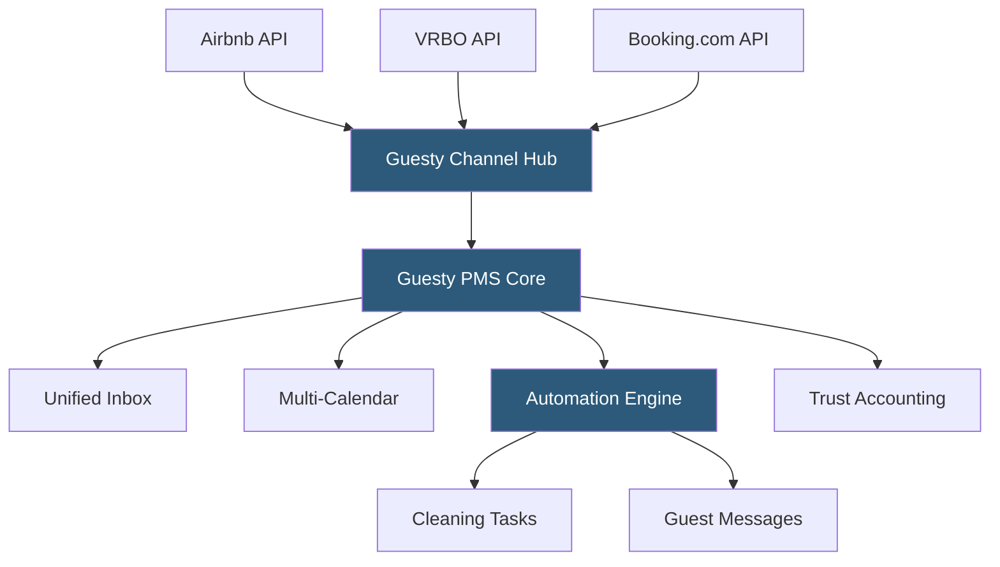

**Category:** Restaurant & Hospitality Hosting
**Difficulty:** Intermediate
**Reading time:** 6 min read

---

Guesty is a comprehensive vacation rental property management platform designed for professional property managers and management companies handling short-term rentals at scale. It provides a unified interface for managing listings across Airbnb, VRBO, Booking.com, and direct channels, with automation tools for guest communication, pricing, operations, and financial reporting.

- **Guesty Inbox** — a centralized inbox aggregating all guest messages across every connected OTA into a single threaded view
- **Multi-Calendar** — a unified availability view showing all listings and bookings across all platforms on one grid
- **Guesty Pay** — integrated payment processing enabling direct booking payments and automated payment collection
- **Automation Engine** — event-triggered actions for messaging, task assignment, and operational workflows
- **Guesty for Hosts** — a lighter-tier product for individual hosts managing fewer than 4 properties
- **Open API** — Guesty's REST API enabling custom integrations with accounting systems, revenue tools, and smart home devices
- **Trust Accounting** — financial management module separating owner funds from management fees per property

Guesty connects to OTA platforms through official API partnerships, enabling real-time two-way synchronization. When a property manager onboards a listing, they connect it to their Guesty account, which authenticates with each OTA via OAuth and establishes a persistent connection. Guesty polls each OTA's reservation API at regular intervals and also receives webhook notifications for new bookings, cancellations, and modifications.

The automation engine is central to Guesty's value proposition. Property managers configure rule-based workflows using a visual builder: "When a reservation is confirmed → Send welcome message → 24 hours before check-in, send access code → On checkout day, assign cleaning task to housekeeping team → 2 hours after checkout, send review request." These automations run without human intervention, handling the repetitive work that previously required staff attention for each reservation.

Guest communications route through Guesty's unified inbox regardless of which platform the guest booked through. Replies sent from the Guesty inbox post back to the originating OTA's messaging system so guests receive responses in their native app. AI-powered smart replies analyze incoming messages and suggest responses based on common inquiry patterns (check-in instructions, parking, WiFi).

Trust accounting separates management activity by owner, tracking gross revenue, platform fees, cleaning charges, and management commission per property. Automated owner statements generate monthly, and Guesty integrates with QuickBooks and Xero for accounting synchronization.

- Property management companies managing 10–500+ listings
- Vacation rental managers seeking automated guest communication
- Multi-owner management companies needing trust accounting
- Operators distributing properties across 5+ booking channels
- Companies building custom workflows via Guesty's open API

| Advantage | Disadvantage |
|-----------|--------------|
| Enterprise-grade automation scales with portfolio | Per-listing pricing makes large portfolios expensive |
| Trust accounting supports professional management business | Complexity requires onboarding and training investment |
| Official API connections ensure reliable sync | Some features (Guesty Pay) only available in select markets |
| Open API enables deep custom integrations | Smaller operations may find Guesty for Hosts sufficient |

- [Airbnb Property Management](airbnb-property-management.md)
- [Hostfully Property Management](hostfully-property-management.md)
- [Hotel Channel Manager Hosting](hotel-channel-manager-hosting.md)

---
*Part of the [Restaurant & Hospitality Hosting](index.md) category · [Back to Master Index](../../index.md)*
