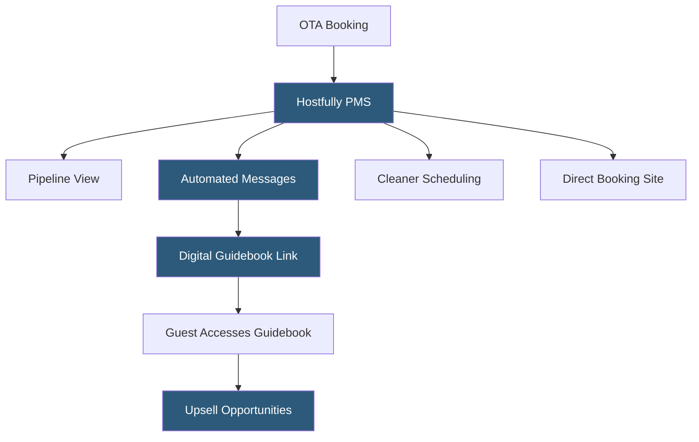

**Category:** Restaurant & Hospitality Hosting
**Difficulty:** Beginner
**Reading time:** 5 min read

---

Hostfully is a vacation rental property management platform combining PMS functionality with digital guidebooks that provide guests with property instructions, local recommendations, and service upsell opportunities. It targets small to mid-size property managers who want both operational management tools and an enhanced guest experience layer.

- **Digital Guidebook** — a hosted web-based property manual containing check-in instructions, house rules, WiFi details, and local recommendations
- **Hostfully Pipeline** — a visual kanban-style interface for tracking reservations through operational stages
- **Channel Connections** — integrations with Airbnb, VRBO, Booking.com, and Marriott Homes & Villas
- **Upsell Engine** — a feature within guidebooks allowing guests to purchase add-ons (early check-in, airport transfers, experiences)
- **Automated Messaging** — triggered message sequences for booking events delivered to guests via the OTA or direct email/SMS
- **Cleaner Dashboard** — a dedicated view for housekeeping teams showing upcoming turnover schedules
- **Direct Booking Website** — a free hosted booking website included with Hostfully accounts for commission-free bookings

Hostfully connects to OTAs through API partnerships and iCal feeds, synchronizing reservation data into a centralized PMS. The pipeline view presents reservations as cards moving through configurable stages—Inquiry, Confirmed, Pre-Arrival, Checked In, Post-Stay—giving property managers a visual snapshot of operational status across their portfolio.

The digital guidebook is Hostfully's differentiating feature. Each property has a branded, mobile-optimized guidebook hosted on Hostfully's CDN. Managers populate it with property-specific content: check-in procedure (including door code or lockbox combination), WiFi password, appliance guides, checkout instructions, parking directions, and local recommendations for restaurants, activities, and services. When a reservation confirms, the automated messaging system delivers the guidebook link to the guest.

The upsell engine within guidebooks allows managers to offer paid services. Guests browsing the guidebook pre-arrival can purchase early check-in, luggage storage, a welcome grocery basket from a local service, or activity bookings. Payments process through Stripe, and confirmation routes back to the property manager for fulfillment coordination.

Cleaning schedules auto-populate from reservation data. As reservations confirm and checkouts occur, Hostfully pushes turnover tasks to the cleaner dashboard showing the property name, checkout time, next check-in time, and cleaning notes. Cleaners mark tasks complete when finished.

- Property managers wanting enhanced guest experience via digital guidebooks
- Hosts offering upsell services as incremental revenue
- Small portfolios (3–50 properties) seeking affordable PMS
- Operators using guidebooks to reduce repetitive guest inquiry messages
- Managers wanting a bundled direct booking website

| Advantage | Disadvantage |
|-----------|--------------|
| Digital guidebook reduces guest inquiry volume | Feature depth less than enterprise platforms like Guesty |
| Upsell revenue adds incremental income per stay | Limited trust accounting for large management companies |
| User-friendly interface reduces learning curve | Channel connectivity fewer than top-tier competitors |
| Free direct booking website included | Advanced automations require higher subscription tiers |

- [Guesty Vacation Rental Platform](guesty-vacation-rental-platform.md)
- [Airbnb Property Management](airbnb-property-management.md)
- [Hotel Booking Engine Hosting](hotel-booking-engine-hosting.md)

---
*Part of the [Restaurant & Hospitality Hosting](index.md) category · [Back to Master Index](../../index.md)*
