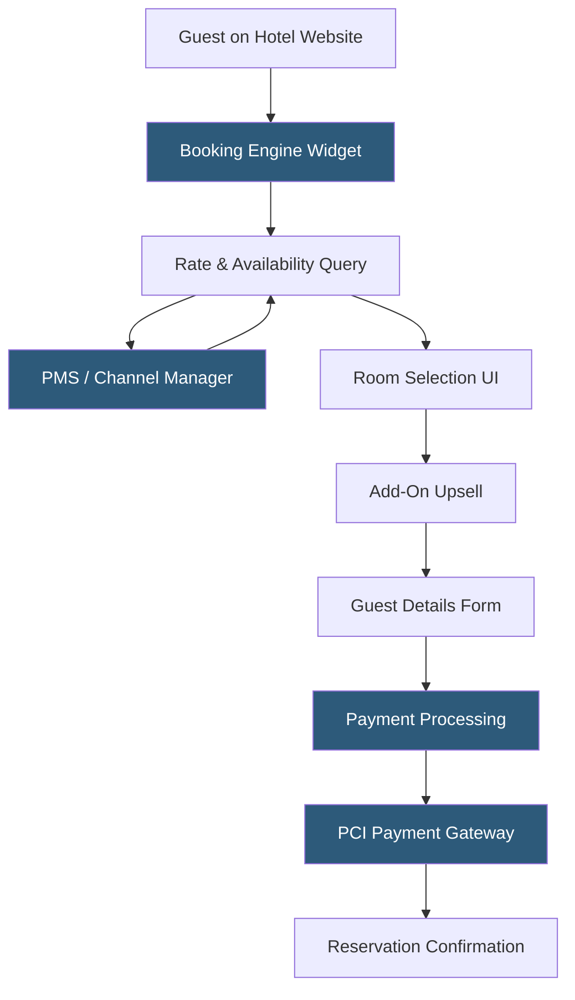

**Category:** Restaurant & Hospitality Hosting
**Difficulty:** Intermediate
**Reading time:** 6 min read

---

A hotel booking engine is a hosted web application embedded in a hotel's website that enables guests to search availability, select rooms, and complete reservations directly with the property—bypassing OTA commission fees. Booking engines query the PMS or channel manager for live inventory and rates, then process payments through PCI-compliant payment gateways.

- **IBE (Internet Booking Engine)** — the industry term for the hosted booking application displaying real-time room availability
- **Rate Fence** — rules restricting certain rates to specific booking channels, dates, or guest types to drive direct booking
- **Upsell Module** — a component presenting room upgrades, early check-in, or add-on packages during the booking flow
- **Conversion Rate** — the percentage of booking engine visitors who complete a reservation; industry average is 2–4%
- **Looker/Booker Ratio** — the ratio of guests who search rates to those who complete booking, used to identify friction points
- **Abandonment Recovery** — automated emails to guests who started but did not complete a booking
- **Best Rate Guarantee (BRG)** — a policy promising the lowest available rate on the direct booking engine vs. any OTA

Booking engines are hosted SaaS applications typically delivered as a JavaScript embed or an iFrame widget that loads within the hotel's website. When a guest selects check-in and check-out dates and number of guests, the booking engine sends an availability request to the connected PMS or channel manager API. The API responds with available room types, rates, and restrictions (minimum stay, advance purchase requirements). The booking engine renders this data into a visual room-selection interface with photography, amenity descriptions, and pricing.

The booking engine applies rate fencing logic to show exclusive direct rates—non-refundable discounts, loyalty member rates, or package bundles not available on OTAs. This incentivizes direct booking. During the room selection step, an upsell module presents upgrades (standard to deluxe room at $20/night) or experiences (welcome champagne, late checkout) as optional add-ons that post to the folio.

At checkout, the payment form captures card data in a PCI-compliant hosted fields component, tokenizing the number before it reaches the booking engine server. The token is passed to a payment gateway (Stripe, Adyen, Braintree) for pre-authorization. On approval, the booking engine creates a confirmed reservation in the PMS via API and sends a confirmation email with booking details.

Abandonment recovery tracks sessions where guests entered check-in dates but did not complete booking. If an email was captured earlier in the flow, an automated sequence fires 1–2 hours later with a gentle reminder and optional incentive.

- Hotels converting website visitors to direct bookings to reduce OTA dependency
- Resorts presenting package bundles including activities and dining
- Properties with loyalty programs offering member-exclusive rates
- Hotels wanting integrated upsell revenue from booking flow
- Groups managing block bookings with event-specific booking pages

| Advantage | Disadvantage |
|-----------|--------------|
| Zero commission on direct bookings vs. 15–25% OTA commission | Requires hotel website traffic; OTAs provide demand generation |
| Full guest data ownership for CRM and marketing | Conversion rate optimization requires ongoing investment |
| Upsell revenue captured at booking increases RevPAR | Integration complexity with PMS rate/inventory management |
| Brand experience fully controlled by the property | Metasearch advertising costs to drive direct traffic |

- [Hotel Channel Manager Hosting](hotel-channel-manager-hosting.md)
- [SiteMinder Channel Manager](siteminder-channel-manager.md)
- [Airbnb Property Management](airbnb-property-management.md)

---
*Part of the [Restaurant & Hospitality Hosting](index.md) category · [Back to Master Index](../../index.md)*
