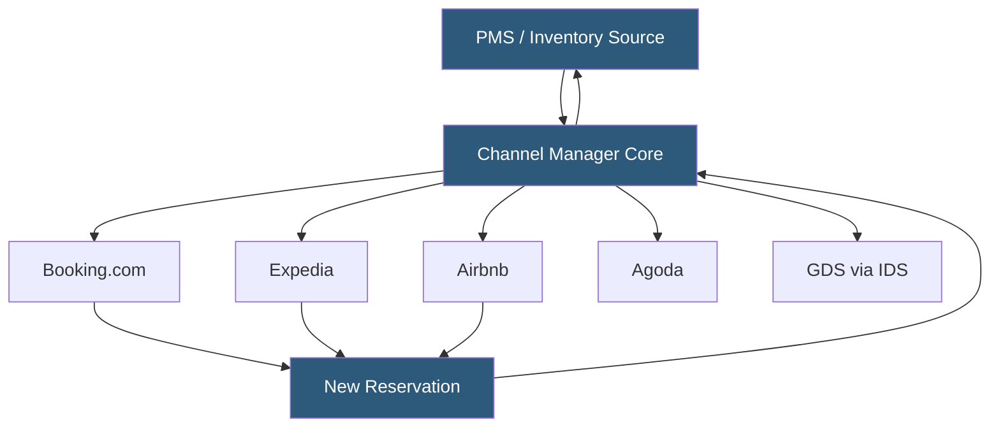

**Category:** Restaurant & Hospitality Hosting
**Difficulty:** Intermediate
**Reading time:** 6 min read

---

A hotel channel manager is a hosted middleware platform that distributes room availability, rates, and inventory (ARI) from a property management system to dozens of online travel agencies and booking platforms simultaneously. It maintains inventory synchronization in real time to prevent overbooking and centralizes rate management across all distribution channels.

- **ARI** — Availability, Rates, and Inventory: the three data types synchronized between PMS and OTAs
- **Two-Way XML** — bidirectional communication where the channel manager both pushes ARI updates and receives new reservations from OTAs
- **OTA** — Online Travel Agency (Booking.com, Expedia, Agoda) that receives inventory from the channel manager and pays commission on bookings
- **Rate Parity** — the policy of maintaining equal rates across all channels; channel managers help enforce this by distributing rates uniformly
- **Connectivity Standard** — industry protocols like OTA (HTNG) XML, OpenTravel Alliance schemas, or vendor-specific APIs used for channel connections
- **Derived Rate** — a rate automatically calculated as a percentage or fixed modifier from a base rate, propagated to all channels
- **Booking Pickup** — the aggregated dashboard view showing new reservations by channel, date, and rate type

Channel managers operate as a publish-subscribe hub. When a hotel manager updates rates or closes availability in the PMS (or in the channel manager's own dashboard), the platform serializes the ARI change into each connected OTA's required XML or JSON format and pushes updates through persistent HTTP connections or message queues. Major OTAs like Booking.com and Expedia maintain pooled inventory models where a single update propagates to multiple rate plans and room types automatically.

The reverse flow is equally critical. When a guest books on an OTA, the OTA sends a reservation notification to the channel manager, which immediately reduces available inventory for that room type and date range across all other channels. This inventory deduction must complete in under 30 seconds to meet OTA SLA requirements. The channel manager then relays the new reservation to the PMS through its own API or XML push.

To prevent overbooking during high-demand periods, channel managers use a buffer system—reserving a configurable number of rooms as "closed to all OTAs" that can only be sold through the direct booking engine or front desk. This safety buffer accounts for any race conditions in the update propagation cycle.

Hosted channel managers (SiteMinder, RateGain, Cloudbeds channel manager, Rentals United for vacation rentals) maintain certifications with each OTA, managing the technical relationship and credential management so hotels only configure room types and rates once.

- Independent hotels selling across 10+ OTA channels simultaneously
- Multi-property groups managing centralized rate strategy
- Vacation rental managers distributing properties to Airbnb, VRBO, and direct channels
- Revenue managers testing rate strategies across specific channel subsets
- Hotels seeking real-time overbooking prevention across all sales channels

| Advantage | Disadvantage |
|-----------|--------------|
| Single update propagates to all channels instantly | Propagation latency (5–30 seconds) creates small overbooking windows |
| Eliminates manual extranet log-ins for each OTA | Adds another integration layer with associated failure modes |
| Centralized rate management simplifies revenue strategy | Monthly subscription cost adds to distribution expenses |
| Built-in OTA certifications reduce connectivity complexity | Limited control over OTA-side display and ranking algorithms |

- [SiteMinder Channel Manager](siteminder-channel-manager.md)
- [Hotel Property Management Systems (PMS)](hotel-property-management-systems-pms.md)
- [Hotel Booking Engine Hosting](hotel-booking-engine-hosting.md)

---
*Part of the [Restaurant & Hospitality Hosting](index.md) category · [Back to Master Index](../../index.md)*
