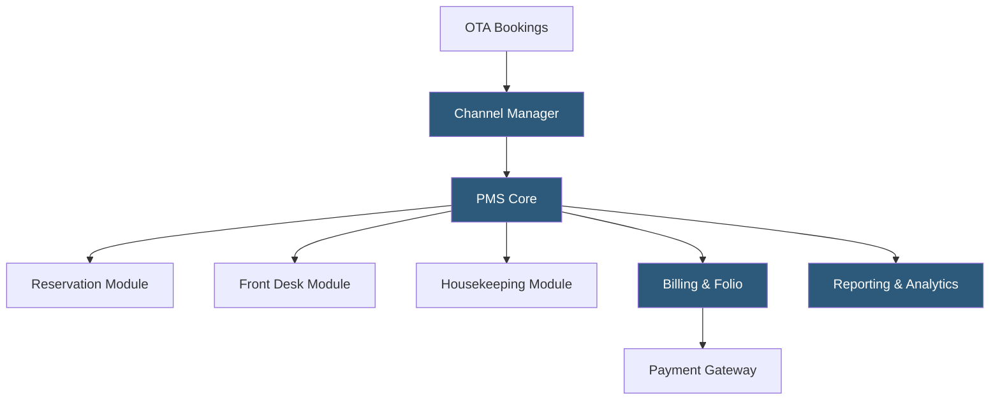

**Category:** Restaurant & Hospitality Hosting
**Difficulty:** Intermediate
**Reading time:** 7 min read

---

A hotel property management system (PMS) is the central operational software managing reservations, front desk check-in/check-out, housekeeping assignments, billing, and reporting for a lodging property. Modern cloud PMS platforms replace on-premises server installations with SaaS architectures that sync in real time across all departments and integrate with channel managers, revenue management systems, and restaurant POS.

- **Room Rate Management** — dynamic pricing logic within the PMS adjusting rates based on occupancy, demand signals, and restrictions
- **Folio** — a guest's running bill aggregating all charges from room, restaurant, spa, and incidentals
- **Channel Manager** — a middleware layer distributing rate and availability from the PMS to OTAs and booking engines
- **PMS-POS Integration** — posting restaurant or bar charges directly to a guest's room folio from the F&B POS system
- **Housekeeping Module** — tracks room cleaning status (dirty, clean, inspected, out-of-order) updated by housekeeping staff via mobile app
- **Night Audit** — an automated end-of-day process posting room charges, reconciling transactions, and rolling the business date
- **OTA** — Online Travel Agency (Booking.com, Expedia) that sends reservation data to the PMS via channel manager

Cloud PMS platforms store all reservation and guest data in a multi-tenant SaaS database with property-level isolation. When a reservation arrives—from OTA, direct booking engine, GDS, or walk-in—the PMS creates a reservation record with room type, rate plan, guest profile, and special requests. Inventory is updated in real time and propagated back through the channel manager to prevent double bookings.

At check-in, front desk staff verify the reservation, assign a specific room (factoring in preferences and housekeeping status), capture a payment method, and activate the key card through an encoder integration. The PMS creates an open folio. Throughout the stay, charges from the restaurant POS, spa, parking, or mini-bar post automatically to the folio via property-level integrations over a local network or cloud API.

The housekeeping module shows room status on a mobile dashboard. As housekeepers clean rooms, they update status from "dirty" to "clean" via a tablet app; supervisors mark rooms "inspected." The front desk module displays real-time room readiness, enabling early check-in management.

Night audit runs automatically at a configured time, posting room charges and taxes to all open folios, running balance reports, and rolling the system date. At checkout, the PMS presents the itemized folio to the guest, processes payment, and closes the folio. Leading cloud platforms include Opera Cloud (Oracle), Mews, Cloudbeds, and Apaleo, offering REST APIs for deep integrations.

- Full-service hotels managing complex multi-department charge posting
- Boutique properties needing affordable SaaS PMS without on-premises servers
- Multi-property hotel groups requiring centralized reporting and shared guest profiles
- Vacation rental operators managing check-in automation and cleaning schedules
- Resorts integrating spa, golf, and F&B charges into unified guest folios

| Advantage | Disadvantage |
|-----------|--------------|
| Real-time inventory across all distribution channels | Internet dependency—cloud PMS requires reliable connectivity |
| Eliminates on-premises server maintenance | Data migration from legacy PMS is complex and time-consuming |
| Mobile-accessible for front desk and housekeeping | Higher ongoing SaaS cost vs. paid-off legacy systems |
| API ecosystem enables deep third-party integrations | Learning curve for staff accustomed to legacy interfaces |

- [Opera PMS Cloud Hosting](opera-pms-cloud-hosting.md)
- [Hotel Channel Manager Hosting](hotel-channel-manager-hosting.md)
- [Cloudbeds Hotel Platform](cloudbeds-hotel-platform.md)

---
*Part of the [Restaurant & Hospitality Hosting](index.md) category · [Back to Master Index](../../index.md)*
