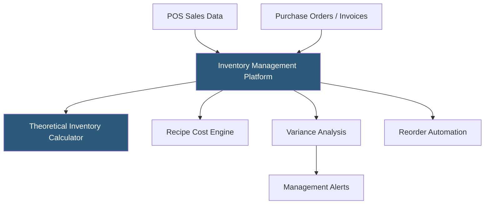

**Category:** Restaurant & Hospitality Hosting
**Difficulty:** Intermediate
**Reading time:** 6 min read

---

Restaurant inventory management platforms track ingredient quantities from purchase to plate, enabling operators to monitor food cost percentage, reduce waste, and identify shrinkage. Cloud-based systems connect purchase orders, vendor invoices, recipe costs, and POS sales data to provide real-time visibility into theoretical versus actual inventory usage. Accurate inventory management is among the highest-ROI operational improvements available to restaurant operators.

- **Par Levels** — Minimum and target inventory quantities triggering automatic reorder suggestions when stock falls below threshold
- **Recipe Costing** — Detailed cost calculation for each menu item based on ingredient quantities and current purchase prices
- **Theoretical vs Actual** — Comparison between calculated expected usage based on sales and actual inventory depletion, identifying waste and theft
- **Vendor Integration** — Direct connection to distributor ordering systems for electronic purchase orders and invoice reconciliation
- **FIFO Tracking** — First In, First Out rotation tracking ensuring oldest inventory is used before newer stock
- **Food Cost Percentage** — The core KPI: ingredient cost divided by menu item price, industry benchmark varies by segment

Inventory management platforms integrate with the POS to receive sales data for every item sold. The recipe engine multiplies each sale by the ingredient quantities in that item's recipe, calculating theoretical depletion — how much of each ingredient should have been used based on sales. Physical inventory counts, entered periodically (daily for high-cost items, weekly for others), provide actual quantities on hand.

The variance between theoretical and actual usage surfaces as the variance report — the restaurant's primary tool for identifying waste, over-portioning, spillage, or theft. A significant variance on a high-cost ingredient like protein or seafood warrants immediate investigation. Vendor invoice reconciliation catches pricing discrepancies and quantity shortfalls before payment.

Recipe costing tools calculate the exact cost of every menu item, enabling managers to monitor food cost percentage by item and by category. When ingredient prices change due to market fluctuations, the platform recalculates all affected recipe costs and surfaces items where the margin has fallen below acceptable thresholds, prompting menu price adjustments or recipe modifications.

- Full-service restaurants monitoring food cost percentage weekly
- Restaurant groups centralizing purchasing across multiple locations
- High-volume operations where small efficiency gains in cost translate to significant profit
- Restaurants with extensive prep-forward menus needing waste tracking
- Operators building data for menu engineering decisions

| Advantage | Disadvantage |
|-----------|--------------|
| Directly improves food cost percentage through variance visibility | Requires consistent physical counting discipline |
| Recipe cost changes automatically when ingredient prices update | Time investment in initial recipe build-out |
| Vendor integration streamlines ordering and invoice reconciliation | Staff training required for accurate inventory entry |
| Shrinkage visibility deters theft | Data quality depends on accurate recipe and ingredient setup |

- [MarketMan Inventory Platform](marketman-inventory-platform.md)
- [Recipe Costing Software](recipe-costing-software.md)
- [Restaurant Analytics Platforms](restaurant-analytics-platforms.md)

---
*Part of the [Restaurant & Hospitality Hosting](index.md) category · [Back to Master Index](../../index.md)*
