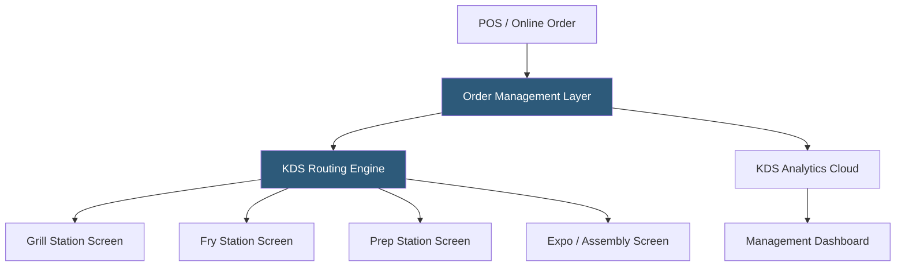

**Category:** Restaurant & Hospitality Hosting
**Difficulty:** Intermediate
**Reading time:** 6 min read

---

Kitchen Display Systems replace printed paper tickets with digital screens showing orders in real time, enabling faster throughput, reduced ticket loss, and cook-time analytics. Cloud-connected KDS platforms store order history, track preparation times, and provide management dashboards measuring kitchen performance. Modern KDS systems integrate tightly with POS platforms and online ordering channels.

- **Order Routing** — Logic defining which KDS screens display which menu items based on category (grill, fry, prep, expo)
- **Cook Time Tracking** — Timestamps for when each item fires, is bumped (marked in progress), and completed
- **Coursing** — Sequential firing of courses to coordinate entree delivery timing with appetizers being cleared
- **Recall Screen** — Ability to retrieve recently completed tickets for corrections or reorders
- **Expo Screen** — The final assembly and quality check display where completed items are aggregated before service
- **Performance Analytics** — Cloud dashboard reporting average ticket times, bottlenecks, and throughput by station

When an order is submitted through the POS or online ordering platform, the KDS routing engine analyzes each item and fires it to the appropriate kitchen station based on category rules. A burger order sends the patty to the grill screen, the bun to the prep screen, and fries to the fry screen — independently, so each station begins preparation without waiting for a unified ticket. The expo screen aggregates items as they're completed, showing which components are ready and which are still pending.

Bump bars — physical controllers with large buttons — allow cooks to mark items in progress or completed with one touch, maintaining speed in busy environments. Modern touchscreen KDS displays allow swiping to bump or hold tickets. Color coding indicates ticket age: new orders typically display green, approaching target time turn yellow, and overdue tickets turn red.

Cloud analytics record every cook-time event, enabling management to identify bottlenecks — consistently slow stations, problem items, or time-of-day throughput drops. This data drives staffing decisions, menu modifications for operationally complex items, and equipment investments.

- High-volume QSR operations where paper tickets create order loss and confusion
- Multi-station kitchens requiring parallel preparation coordination
- Restaurants with online ordering needing seamless digital-to-kitchen workflows
- Ghost kitchens with multiple virtual brands running from one kitchen
- Analytics-driven operators tracking kitchen performance as an operational KPI

| Advantage | Disadvantage |
|-----------|--------------|
| Eliminates paper ticket loss and readability issues | Requires staff training and adaptation period |
| Real-time cook-time analytics identify bottlenecks | Hardware investment in screens and bump bars |
| Parallel firing across stations speeds throughput | Requires internet connectivity for cloud analytics |
| Online orders route to kitchen without physical re-entry | Screen failure can disrupt kitchen operations |

- [Digital Menu Board Hosting](digital-menu-board-hosting.md)
- [Toast POS Restaurant Platform](toast-pos-restaurant-platform.md)
- [Restaurant Analytics Platforms](restaurant-analytics-platforms.md)

---
*Part of the [Restaurant & Hospitality Hosting](index.md) category · [Back to Master Index](../../index.md)*
