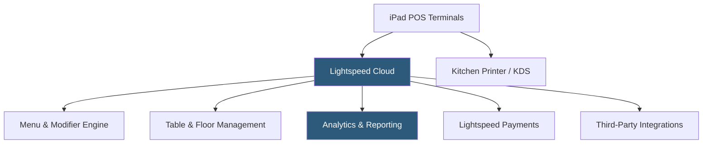

**Category:** Restaurant & Hospitality Hosting
**Difficulty:** Intermediate
**Reading time:** 6 min read

---

Lightspeed Restaurant is a cloud-native POS platform designed for full-service restaurants, bars, and multi-location hospitality groups. Acquired from Upserve, it combines powerful table management, detailed analytics, and an iPad-based interface with enterprise-grade reporting. Lightspeed differentiates through its deep menu intelligence and server performance analytics.

- **Cloud-Native Architecture** — All data resides in Lightspeed's cloud with no required on-premise server
- **Menu Intelligence** — Tracks item performance, popularity, and profitability to guide menu engineering decisions
- **Reservation Integration** — Native or third-party reservation system connections linking covers to POS data
- **Advanced Reporting** — Granular analytics on server performance, item velocity, hour-by-hour sales, and labor costs
- **Lightspeed Payments** — Integrated payment processing with competitive flat-rate pricing
- **Multi-Location Management** — Centralized menu and reporting across multiple restaurant locations from a single account

Lightspeed Restaurant operates on iPad hardware connected to Lightspeed's cloud over the restaurant's internet connection. The platform's architecture stores menus, configurations, and historical data centrally, enabling access from any authorized device. Offline mode caches essential data locally, allowing order taking and payment processing to continue during brief connectivity interruptions with automatic reconciliation when the connection restores.

The menu engine supports complex modifier structures, forced and optional choices, course assignments, and item-level kitchen routing. Table management displays a live floor map with turn times, covers, and server assignments. Reporting dashboards provide real-time and historical views of sales performance, with drill-down capability to individual items, servers, or time periods.

Lightspeed's integration marketplace connects with major accounting platforms, payroll providers, delivery aggregators, and loyalty programs via REST APIs. The platform supports multi-menu scheduling — automatically switching to a brunch menu on weekend mornings, for example — and handles capacity planning for reservation systems.

- Upscale casual and fine dining restaurants needing detailed table and course management
- Multi-location restaurant groups requiring centralized reporting
- Bars and nightclubs managing complex tabs and high transaction volumes
- Hotel food and beverage operations integrated with property management systems
- Restaurants using data-driven menu engineering to optimize profitability

| Advantage | Disadvantage |
|-----------|--------------|
| Deep analytics and menu performance intelligence | Higher price point than entry-level POS platforms |
| Strong multi-location management capabilities | iPad dependency introduces hardware fragility concerns |
| Native online ordering and reservation integration | Steeper learning curve for staff training |
| Robust API ecosystem for integrations | Offline capabilities less robust than some competitors |

- [Toast POS Restaurant Platform](toast-pos-restaurant-platform.md)
- [Upserve Lightspeed Platform](upserve-lightspeed-platform.md)
- [Restaurant Analytics Platforms](restaurant-analytics-platforms.md)

---
*Part of the [Restaurant & Hospitality Hosting](index.md) category · [Back to Master Index](../../index.md)*
