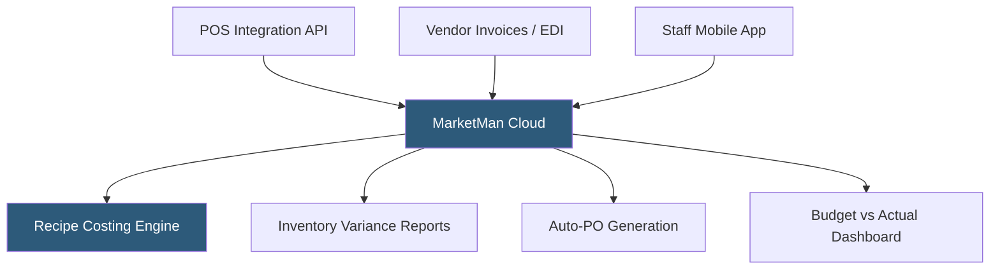

**Category:** Restaurant & Hospitality Hosting
**Difficulty:** Intermediate
**Reading time:** 6 min read

---

MarketMan is a cloud-based restaurant inventory and purchasing management platform focused on food cost control through automated variance analysis, vendor management, and recipe costing. It integrates with major POS systems to pull sales data and calculates theoretical versus actual food costs, providing actionable insights for operators managing ingredient costs. MarketMan serves independent restaurants, chains, and franchise groups globally.

- **MarketMan Mobile App** — Mobile inventory counting tool allowing staff to conduct physical counts from a smartphone or tablet
- **Catalog Management** — Centralized ingredient database with unit-of-measure conversion handling across purchasing and recipe units
- **Budgeting Module** — Cost budget tracking comparing actual spend against targets by category
- **Supplier Price Tracking** — Historical pricing data from multiple vendors enabling cost comparison and negotiation
- **Auto-Ordering** — Automated purchase order generation when inventory falls below defined par levels
- **Multi-Location Aggregation** — Consolidated reporting across locations for groups and franchises

MarketMan connects to the restaurant's POS through an API integration, pulling item-level sales data to calculate ingredient depletion. The platform's recipe engine contains detailed recipes with ingredient quantities and unit-of-measure conversions — a recipe calling for 4 oz of cheese maps to purchasing units of 5 lb blocks, with automatic conversion for cost calculation.

Staff conduct inventory counts using the MarketMan mobile app, scanning barcodes or selecting items from the catalog and entering quantities on-hand. The platform compares counted quantities against calculated theoretical inventory (starting inventory plus received deliveries minus theoretical usage based on sales) to generate the variance report. Persistent variances in specific ingredients trigger investigation workflows.

Vendor invoices imported via EDI, email parsing, or manual entry update both inventory received quantities and purchase pricing. When a vendor raises the price of an ingredient, MarketMan automatically recalculates all affected recipe costs and flags menu items where food cost percentage exceeds the operator's defined maximum. Auto-ordering generates purchase orders to vendors when counts fall below configured par levels, reducing the risk of running out of key ingredients.

- Independent restaurants with $1M+ revenue where food cost management has significant financial impact
- Franchise systems requiring standardized food cost reporting across franchisee locations
- Restaurant groups centralizing vendor relationships and pricing negotiation data
- Operations with high-turnover staff needing simple mobile inventory counting tools
- Operators moving from spreadsheet-based food cost tracking to automated platforms

| Advantage | Disadvantage |
|-----------|--------------|
| Mobile counting app lowers barrier to consistent inventory practice | Requires thorough recipe setup before meaningful variance data appears |
| Automated PO generation reduces ordering oversight effort | Integration quality varies by POS platform |
| Vendor price tracking enables data-driven purchasing decisions | Monthly SaaS fee adds to operational costs |
| Multi-location reporting serves franchise management needs | Initial setup and training investment is significant |

- [Inventory Management for Restaurants](inventory-management-for-restaurants.md)
- [Recipe Costing Software](recipe-costing-software.md)
- [Restaurant Analytics Platforms](restaurant-analytics-platforms.md)

---
*Part of the [Restaurant & Hospitality Hosting](index.md) category · [Back to Master Index](../../index.md)*
