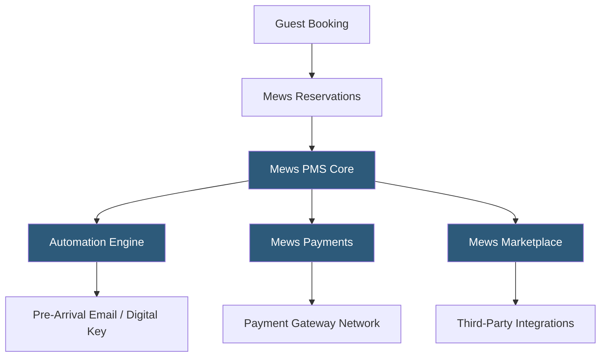

**Category:** Restaurant & Hospitality Hosting
**Difficulty:** Intermediate
**Reading time:** 6 min read

---

Mews is a cloud-native PMS built from the ground up for modern hospitality operations, emphasizing automation, open APIs, and a developer-friendly marketplace. It targets design-forward hotels, hostels, and mixed-use hospitality businesses that want to automate routine operational tasks and build custom integrations. Mews processes over $5 billion in payments annually and operates across 85+ countries.

- **Mews Operations** — the PMS module covering reservations, check-in/out, housekeeping, and billing
- **Mews Payments** — built-in payment processing with virtual card support and automated pre-authorization
- **Mews POS** — an integrated point-of-sale for hotel F&B operations connected natively to guest folios
- **Mews Marketplace** — an app store of 1,000+ certified integrations covering revenue management, upselling, and more
- **Open API** — Mews Connector API provides REST endpoints for all PMS operations, enabling deep custom integrations
- **Online Check-in** — a digital pre-arrival flow allowing guests to complete registration, upload ID, and receive a digital key
- **Automation Engine** — configurable rule-based triggers for tasks like sending emails, assigning rooms, or applying discounts

Mews is architected around an event-sourced data model where all system state changes are recorded as immutable events rather than direct database mutations. This approach provides a complete audit trail for every reservation modification, charge posting, and payment transaction—critical for financial reconciliation and dispute resolution.

The automation engine allows property managers to configure IF-THEN rules without coding: "If reservation is confirmed AND arrival date is 3 days away, THEN send pre-arrival email and trigger online check-in link." Online check-in guides guests through digital registration, ID verification (via integrations with Onfido or Veriff), and payment confirmation. Upon completion, an API call to a smart lock integration (like Salto, Dormakaba, or ASSA ABLOY) generates a mobile key or updates a PIN code.

The Mews Marketplace differentiates the platform. Integration partners build certified apps using the Connector API and list them in the marketplace. Property managers discover and activate integrations in minutes without involving IT. Common integrations include RMS Cloud for revenue management, Nuvola for guest request ticketing, and Duetto for rate intelligence.

Payment processing is handled natively through Mews Payments, which tokenizes card data at capture and stores tokens for future charges. Pre-authorization flows run automatically on check-in to verify sufficient funds, and auto-settlement runs at checkout. Virtual card handling for OTA bookings (Booking.com sends virtual Visa cards for payment) is automated, eliminating manual reconciliation.

- Tech-forward boutique hotels wanting to automate front desk operations
- Hostels managing bed-level inventory with shared bathroom scheduling
- Hotel groups building custom integrations via the open API
- Properties offering keyless check-in and checkout workflows
- Hybrid hospitality venues combining hotel, co-working, and F&B

| Advantage | Disadvantage |
|-----------|--------------|
| Automation reduces front desk labor significantly | UI complexity requires dedicated staff training |
| 1,000+ marketplace integrations cover most use cases | Less suitable for very large branded chain operations |
| Open API enables highly customizable workflows | Some advanced features require additional modules |
| Event-sourced model provides superior audit trails | Higher base price than simpler PMS competitors |

- [Hotel Property Management Systems (PMS)](hotel-property-management-systems-pms.md)
- [Cloudbeds Hotel Platform](cloudbeds-hotel-platform.md)
- [Hotel Channel Manager Hosting](hotel-channel-manager-hosting.md)

---
*Part of the [Restaurant & Hospitality Hosting](index.md) category · [Back to Master Index](../../index.md)*
