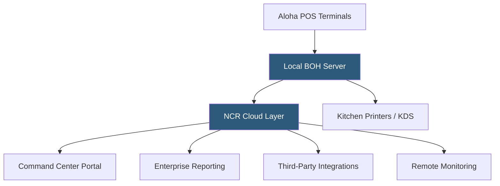

**Category:** Restaurant & Hospitality Hosting
**Difficulty:** Intermediate
**Reading time:** 6 min read

---

NCR Aloha is one of the longest-established restaurant POS platforms in the industry, with a legacy spanning three decades and a current cloud offering extending that heritage. Aloha Cloud modernizes the traditional on-premise Aloha installation with a cloud-connected management layer, making it a hybrid platform trusted by major national restaurant chains. NCR serves fast food, casual dining, and fine dining segments with differentiated product tiers.

- **Aloha Legacy** — On-premise Windows-based POS with decades of restaurant industry adoption and deep integrations
- **Aloha Cloud** — Cloud management layer enabling remote menu management, reporting, and software updates atop existing Aloha installations
- **NCR Voyix** — The spin-off commerce division (formerly NCR) continuing the restaurant technology portfolio
- **Command Center** — Web portal for multi-location reporting, menu management, and system monitoring
- **Aloha Essentials** — All-in-one hardware bundle including terminals, KDS, and payments for new deployments
- **Enterprise Class** — Dedicated enterprise tier supporting thousands of locations with custom SLA agreements

NCR Aloha's traditional deployment runs a back-of-house (BOH) server on-premise within the restaurant, with POS terminals connecting to it over the local network. This provides robust offline capability — the restaurant operates normally without any cloud connectivity. The Aloha Cloud layer connects to this local infrastructure and exposes it through the Command Center web portal, enabling remote menu updates, pricing changes, and monitoring across locations.

For new deployments, Aloha Essentials provides an all-in-one package with NCR hardware, Aloha software, and integrated payments in a managed service model. This shifts responsibility for hardware maintenance and software updates to NCR, reducing the IT burden on operators.

The platform's enterprise tier serves major chains with dedicated implementation teams, custom integration work, and SLA-backed uptime guarantees. Aloha integrates with virtually all major hospitality systems through decades of API development — loyalty platforms, labor management, inventory, delivery aggregators, and enterprise reporting tools all have established Aloha connectors.

- Large QSR chains with existing Aloha infrastructure modernizing with cloud management
- Multi-unit casual dining operators requiring enterprise reporting
- Franchise systems with established Aloha-based workflows
- Restaurants requiring deep integration with legacy hospitality systems
- High-volume drive-through operations needing proven throughput performance

| Advantage | Disadvantage |
|-----------|--------------|
| Decades of proven reliability in high-volume environments | Legacy architecture adds complexity to modern cloud features |
| Extensive integration ecosystem built over decades | Higher total cost than newer cloud-native competitors |
| True offline operation via local server | Implementation requires certified NCR resellers |
| Enterprise support with dedicated account management | Transitioning from on-premise to full cloud is incremental |

- [Oracle MICROS Hosting](oracle-micros-hosting.md)
- [Revel Systems Restaurant](revel-systems-restaurant.md)
- [Restaurant Analytics Platforms](restaurant-analytics-platforms.md)

---
*Part of the [Restaurant & Hospitality Hosting](index.md) category · [Back to Master Index](../../index.md)*
