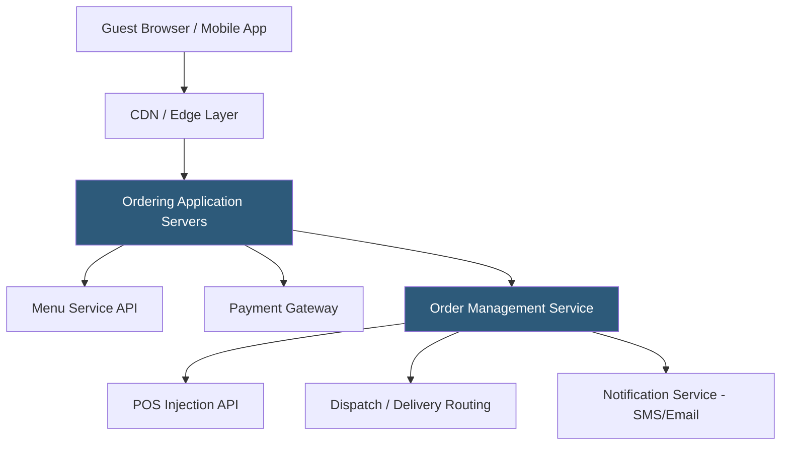

**Category:** Restaurant & Hospitality Hosting
**Difficulty:** Intermediate
**Reading time:** 6 min read

---

Online ordering platform hosting encompasses the cloud infrastructure and software layers that power restaurant direct-ordering experiences. These platforms must handle unpredictable traffic spikes at meal times, integrate with POS systems, process payments securely, and coordinate delivery logistics — all within seconds of a customer submitting an order. Architecture decisions around availability, latency, and scalability directly impact restaurant revenue.

- **Menu API** — RESTful service exposing menu data to the ordering front-end, with real-time availability updates
- **Order Injection** — The process of inserting a customer order directly into the restaurant's POS system
- **Traffic Surge Handling** — Auto-scaling infrastructure that absorbs the 12pm and 6pm daily ordering spikes
- **Payment Processing** — PCI-compliant card tokenization and authorization integrated into the ordering flow
- **Order Throttling** — Configurable pacing controls preventing more orders than the kitchen can handle
- **Multi-Location Routing** — Logic directing orders to the correct location based on guest proximity or explicit selection

Online ordering platforms are typically deployed as multi-tenant SaaS infrastructure where the provider manages all cloud resources and restaurants access the service via APIs and configuration portals. The architecture uses a CDN to serve the ordering front-end (HTML, CSS, JavaScript) from edge locations close to the user, minimizing page load times that directly correlate with ordering conversion rates.

When a guest submits an order, the order management service validates items against current menu availability, calculates totals including applicable taxes, and submits the payment for authorization. Successful authorization triggers order injection — an API call to the restaurant's POS system (or a cloud queue if the POS is temporarily unavailable) creating a ticket visible to kitchen staff. The notification service sends confirmation via SMS or email with estimated pickup or delivery times.

Scalability is achieved through auto-scaling application server pools that grow to meet demand during peak meal periods and shrink during off-hours, controlling costs. Database layers typically use read replicas for menu and catalog queries, with write operations on primary nodes for order creation. Multi-region deployment with failover protects against datacenter-level outages.

- Restaurant chains building branded ordering apps independent of marketplaces
- Ghost kitchen operators with no physical dining room
- Multi-location franchises needing consistent ordering experiences
- Catering-focused restaurants handling advance large-party orders
- Cafeterias and corporate dining with pre-ordering for scheduled pickup

| Advantage | Disadvantage |
|-----------|--------------|
| Direct channel eliminates third-party commission fees | Driving traffic to direct channel requires marketing investment |
| Full control over ordering experience and branding | Infrastructure management complexity for custom builds |
| Customer data ownership enables personalization | Reliability depends on platform uptime guarantees |
| Integration with loyalty and CRM platforms | Integration maintenance with POS APIs requires ongoing work |

- [Toast Online Ordering](toast-online-ordering.md)
- [ChowNow Online Ordering](chownow-online-ordering.md)
- [BentoBox Restaurant Websites](bentobox-restaurant-websites.md)

---
*Part of the [Restaurant & Hospitality Hosting](index.md) category · [Back to Master Index](../../index.md)*
