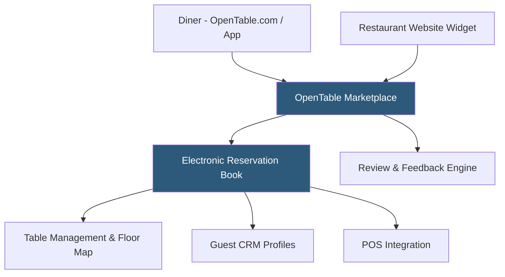

**Category:** Restaurant & Hospitality Hosting
**Difficulty:** Beginner
**Reading time:** 5 min read

---

OpenTable is the dominant restaurant reservation platform in North America, operating both a consumer discovery marketplace and a restaurant management system. Restaurants benefit from OpenTable's network of tens of millions of diners while accessing table management, guest CRM, and review tools. The dual role as marketplace and management system creates both value and dependency for restaurant operators.

- **Diner Network** — Consumer marketplace with millions of active diners discovering and booking restaurants
- **Electronic Reservation Book (ERB)** — The operator-facing table management and reservation interface
- **GuestCenter** — Mobile app for front-of-house staff managing the floor, waitlist, and guest information
- **Cover Fees** — Per-cover charges for reservations made through OpenTable's marketplace (not direct-booking widget)
- **OpenTable Connect** — Widget for accepting reservations directly through the restaurant's own website
- **Guest Feedback** — Post-dining survey system generating aggregate reputation scores visible to diners

OpenTable's platform separates into two interconnected components: the consumer marketplace where diners search and book, and the restaurant management system where operators manage reservations and the floor. Reservations flow into the Electronic Reservation Book from all sources — OpenTable.com, the mobile app, Google Reserve, and the restaurant's own website widget — appearing in a unified calendar view.

Cover fees apply when diners book through OpenTable's marketplace but not when they book through the restaurant's own website widget (Connect), creating an incentive for operators to drive direct bookings. The GuestCenter mobile app provides floor staff with a live view of the dining room, walk-in waitlist, and guest profile access.

OpenTable's guest profiles are network-wide — a diner's allergy notes and dining history are visible to any OpenTable restaurant they visit, theoretically enabling personalized service at first visit. However, this data belongs to OpenTable, not the individual restaurant, creating data ownership concerns. Reputation scores visible on the marketplace aggregate verified post-dining surveys.

- Fine and upscale casual dining restaurants wanting marketplace exposure
- Restaurants in competitive markets where OpenTable diner flow justifies per-cover fees
- Hotel restaurants benefiting from concierge-integrated booking
- Restaurant groups seeking unified reporting across locations on one platform
- Operators wanting automated reputation management through verified reviews

| Advantage | Disadvantage |
|-----------|--------------|
| Access to millions of active diners through marketplace | Per-cover fees for marketplace bookings add up significantly |
| Network-wide guest profiles enable personalized service | Guest data owned by OpenTable, not the restaurant |
| Comprehensive floor management and CRM tools | Dependency creates leverage concerns if fees increase |
| Strong reputation management through verified reviews | Competitors like Resy and Tock eroding market share |

- [Resy Reservation Hosting](resy-reservation-hosting.md)
- [Restaurant Reservation Systems](restaurant-reservation-systems.md)
- [Yelp Reservations Integration](yelp-reservations-integration.md)

---
*Part of the [Restaurant & Hospitality Hosting](index.md) category · [Back to Master Index](../../index.md)*
