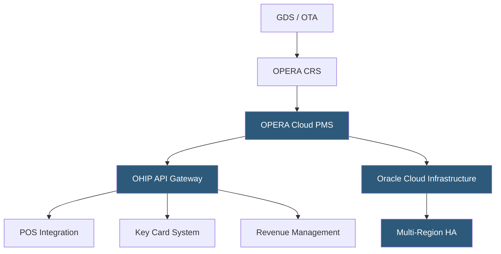

**Category:** Restaurant & Hospitality Hosting
**Difficulty:** Advanced
**Reading time:** 7 min read

---

Oracle Hospitality OPERA Cloud is the enterprise-grade property management system used by major hotel brands and independent full-service properties. It runs on Oracle Cloud Infrastructure (OCI) as a multi-tenant SaaS with a REST API-first architecture, replacing the legacy on-premises Opera 5 that dominated the industry for two decades. OPERA Cloud provides centralized guest profile management, rate configuration, and global distribution across enterprise hotel chains.

- **OHIP (Oracle Hospitality Integration Platform)** — the API gateway exposing OPERA Cloud functionality to third-party integrators
- **Central Reservation System (CRS)** — a shared reservation engine across multiple properties using a common guest profile database
- **Rate Management** — tiered pricing rules within OPERA supporting advance purchase, packages, corporate rates, and dynamic yield
- **Profile Management** — centralized guest, company, travel agent, and group profiles shareable across all properties in a chain
- **HTNG** — Hotel Technology Next Generation standard for hospitality integrations that OPERA Cloud implements
- **OCI** — Oracle Cloud Infrastructure providing the compute, storage, and networking substrate for OPERA Cloud
- **Kiosk Integration** — API connections enabling self-service check-in terminals to perform full PMS operations

OPERA Cloud runs as a containerized application on OCI with multi-region active-active deployment for enterprise customers. Each hotel or hotel group is provisioned as a tenant with logical data isolation; large chains can run a Central Reservation System (CRS) instance that federates reservation data across hundreds of properties while maintaining a single guest profile record.

The OHIP API gateway exposes over 3,000 REST API endpoints covering reservations, profiles, rates, housekeeping, and reporting. Certified third-party vendors—POS systems, key card encoders, revenue management engines, upsell platforms—connect through OHIP using OAuth 2.0 authentication. This eliminates the serial interface dependencies that plagued Opera 5 integrations.

Rate configuration in OPERA Cloud uses a hierarchical structure: rate categories contain rate codes, which can inherit from parent rate schedules. Revenue managers configure selling restrictions (minimum stay, close-to-arrival) and yield overrides through the UI or API. A rate availability engine evaluates each incoming reservation request against these rules in milliseconds, returning available rate options.

Migration from Opera 5 on-premises involves data extraction using Oracle's provided toolset, profile deduplication, and parallel running periods. Oracle provides hosted implementation support through its HIM (Hospitality Implementation Methodology) program. Properties typically run both systems in parallel for 30–90 days before cutover, with the cloud PMS in "shadow" mode to validate data accuracy.

- Large branded hotels requiring chain-wide CRS and profile sharing
- Full-service resort properties managing multi-outlet charge posting
- Hotels transitioning from Opera 5 on-premises to cloud SaaS
- Enterprise chains requiring SOC 2 Type II and PCI DSS Level 1 compliance
- Properties needing deep GDS connectivity (Amadeus, Sabre, Travelport)

| Advantage | Disadvantage |
|-----------|--------------|
| Enterprise-grade reliability with Oracle SLAs | High implementation cost and complexity |
| Deepest third-party certification ecosystem | Slower feature release cycle vs. agile PMS startups |
| Chain-wide CRS scales to thousands of properties | Requires Oracle-certified implementation partner |
| OHIP API enables modern integration patterns | License costs are significant for independent properties |

- [Hotel Property Management Systems (PMS)](hotel-property-management-systems-pms.md)
- [Cloudbeds Hotel Platform](cloudbeds-hotel-platform.md)
- [Mews Hotel Management](mews-hotel-management.md)

---
*Part of the [Restaurant & Hospitality Hosting](index.md) category · [Back to Master Index](../../index.md)*
