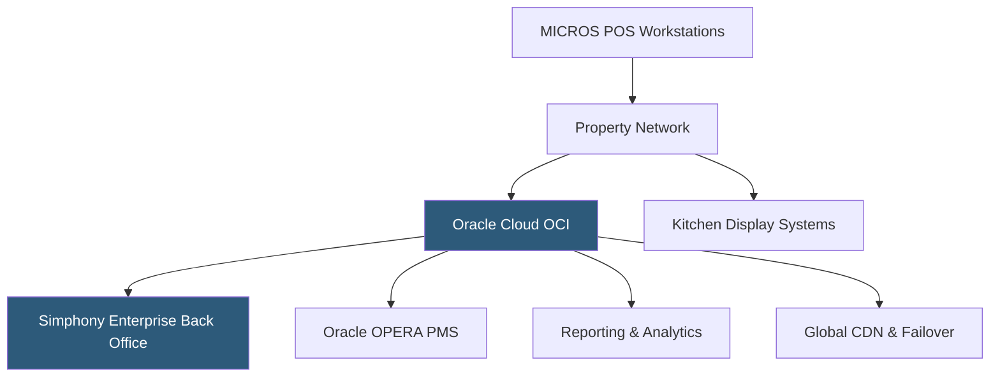

**Category:** Restaurant & Hospitality Hosting
**Difficulty:** Advanced
**Reading time:** 7 min read

---

Oracle MICROS is the enterprise-standard POS and property management platform used by the world's largest hotel chains, casino resorts, stadiums, and theme parks. The MICROS platform handles extreme transaction volumes, complex multi-outlet environments, and deep integration with Oracle's Hospitality suite. Oracle MICROS Simphony, the cloud version, delivers these capabilities on a SaaS model.

- **MICROS Simphony** — Cloud-based POS platform for large-scale hospitality operations, hosted on Oracle Cloud Infrastructure
- **Enterprise Back Office (EBO)** — Centralized management portal controlling menus, pricing, and configuration across hundreds of locations
- **Workstation Hardware** — Oracle-manufactured MICROS terminals engineered for harsh hospitality environments
- **Oracle Hospitality Suite** — Integration with Oracle OPERA PMS, Materials Management, and Reporting & Analytics
- **Multi-Currency Support** — Native support for international currency, tax rules, and fiscal regulations
- **Oracle Cloud Infrastructure (OCI)** — Underlying cloud platform providing global datacenter coverage for Simphony

Oracle MICROS Simphony runs on Oracle Cloud Infrastructure, with the application layer distributed across Oracle's global datacenters. Restaurant and hotel properties connect to the nearest OCI region, with automatic failover to secondary regions ensuring high availability. The Enterprise Back Office provides a hierarchical configuration model — corporate administrators define brand standards, regional managers adjust local parameters, and property managers control outlet-specific settings within permitted bounds.

MICROS workstation hardware is built to food-service specifications: spill-resistant, fan-less designs, and hardened touchscreens rated for kitchen environments. The terminals cache configuration locally, enabling continued operation during brief connectivity interruptions with automatic sync on restoration.

In casino and resort deployments, MICROS integrates with gaming management systems, room charging systems, and loyalty programs, enabling guests to charge food purchases to their room or player card account seamlessly. Multi-outlet resort properties — where a single guest might dine at three different restaurants during a stay — benefit from unified guest profile data across all outlets.

Oracle provides certified implementation partners for large-scale deployments, and enterprise customers receive dedicated support with contractual response-time SLAs. The platform's fiscal compliance module handles country-specific tax reporting requirements for global hotel chains operating across multiple jurisdictions.

- Global hotel chains with hundreds of food and beverage outlets worldwide
- Casino resorts requiring room-charge and player card integration
- Sports stadiums and arenas with thousands of concurrent transactions
- Theme parks and resort complexes with complex multi-outlet environments
- Airport concession operators requiring high-throughput order processing

| Advantage | Disadvantage |
|-----------|--------------|
| Proven at extreme transaction volumes in demanding environments | High implementation and licensing costs |
| Deep integration with Oracle Hospitality suite | Requires Oracle-certified implementation partners |
| Global compliance for international operations | Complex configuration requires specialized expertise |
| Oracle Cloud infrastructure with enterprise SLAs | Less suitable for independent or small-chain operators |

- [NCR Aloha Cloud](ncr-aloha-cloud.md)
- [Hotel Property Management Systems (PMS)](hotel-property-management-systems-pms.md)
- [Opera PMS Cloud Hosting](opera-pms-cloud-hosting.md)

---
*Part of the [Restaurant & Hospitality Hosting](index.md) category · [Back to Master Index](../../index.md)*
