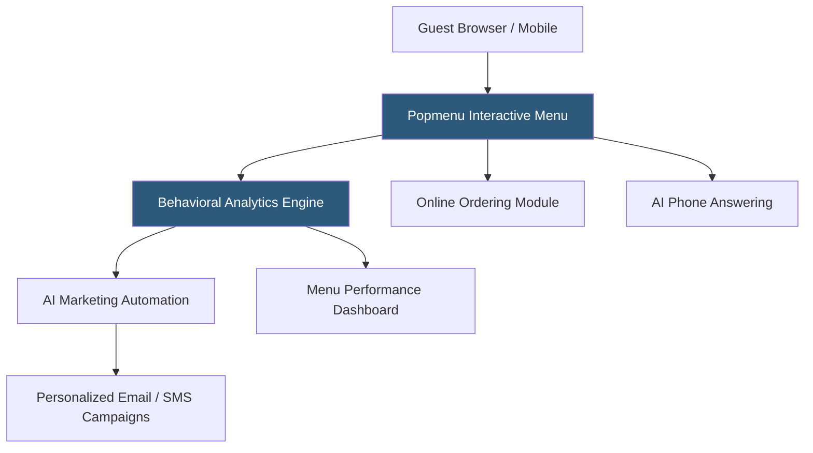

**Category:** Restaurant & Hospitality Hosting
**Difficulty:** Intermediate
**Reading time:** 6 min read

---

Popmenu is a restaurant technology platform centering on interactive digital menus with AI-powered marketing automation. Its signature feature is an interactive menu that tracks which dishes guests view and for how long, using that behavioral data to power personalized marketing and dynamic content. Popmenu combines website hosting, online ordering, and automated guest communication in a restaurant-focused platform.

- **Interactive Menu** — Photo-forward digital menus where guests can view dish details, photos, and reviews, with engagement tracking
- **Menu Intelligence** — Analytics on which items receive the most views, indicating interest versus actual ordering patterns
- **AI-Powered Marketing** — Automated email and text campaigns personalized based on menu browsing and ordering behavior
- **Popmenu AI Answering** — Phone automation that handles common guest inquiries using AI, reducing staff phone burden
- **Dynamic Menu Sync** — Menu updates published in real time across website, online ordering, and Google menus simultaneously
- **Review Aggregation** — Social proof integration displaying Yelp, Google, and Trip Advisor reviews within the menu experience

Popmenu hosts the restaurant's website and interactive menu, tracking every guest interaction: which menu items they view, how long they spend on each dish, which photos they zoom into, and what they ultimately add to cart or order. This behavioral data feeds the platform's marketing automation, which generates personalized campaigns — a guest who repeatedly views the brunch menu but hasn't ordered recently receives a brunch-focused email with the dishes they browsed.

The AI Answering feature handles inbound phone calls with a conversational AI system that knows the restaurant's menu, hours, location, and policies. Guests can ask about parking, dietary accommodations, or make reservations over the phone without staff intervention, with complex inquiries transferred to staff. This addresses the significant labor burden phone management creates for busy restaurants.

Menu updates made in the Popmenu backend propagate simultaneously to the website, online ordering pages, and Google's Business Profile menu display — eliminating the multi-platform update workflows that create menu inconsistencies.

- Restaurants wanting to understand guest menu browsing behavior beyond simple order data
- Independent restaurants building automated marketing without a dedicated marketing team
- Operators with high phone inquiry volume wanting AI-assisted call handling
- Restaurants seeking to reduce menu update labor across multiple digital platforms
- Operators who want personalized guest communication based on dish-level interest signals

| Advantage | Disadvantage |
|-----------|--------------|
| Unique behavioral data on menu interest, not just purchases | Monthly cost higher than basic website platforms |
| AI-powered phone answering reduces staff workload | AI phone handling may frustrate some guests preferring human interaction |
| Single update propagates to all digital menu channels | Platform lock-in as menu and marketing data accumulates |
| Automated personalized marketing without dedicated staff | Data quality depends on traffic volume for meaningful insights |

- [BentoBox Restaurant Websites](bentobox-restaurant-websites.md)
- [Restaurant Menu Management](restaurant-menu-management.md)
- [Restaurant Marketing Automation](restaurant-marketing-automation.md)

---
*Part of the [Restaurant & Hospitality Hosting](index.md) category · [Back to Master Index](../../index.md)*
