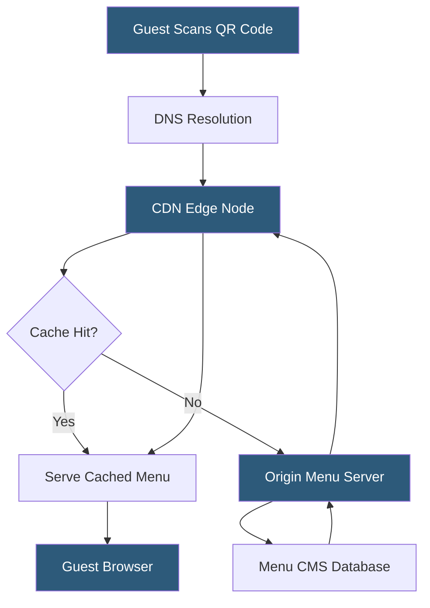

**Category:** Restaurant & Hospitality Hosting
**Difficulty:** Beginner
**Reading time:** 5 min read

---

QR code menu hosting delivers digital menus to guests via scannable codes, eliminating printed menus and enabling real-time updates. Platforms host menu content on CDNs and generate unique QR codes that redirect to mobile-optimized pages. This approach became widespread during the COVID-19 pandemic and has remained popular due to operational and cost benefits.

- **QR Code** — a 2D matrix barcode that encodes a URL; smartphones decode it natively via camera apps
- **Dynamic QR Code** — a code whose destination URL can be changed without reprinting the code itself
- **CDN Delivery** — menu content served from geographically distributed edge nodes for fast load times
- **Menu CMS** — the content management system operators use to update items, prices, and availability
- **Table Linking** — encoding table or section identifiers in the URL for analytics and order routing
- **PWA Menu** — progressive web app menus that cache content offline and behave like native apps
- **Redirect URL** — the hosted endpoint the QR code points to, enabling tracking and A/B testing

QR code menu hosting works in two phases: code generation and menu delivery. During setup, operators create menus in a CMS, which stores item data (name, description, price, images, allergens) in a database. The platform generates a dynamic QR code pointing to a unique hosted URL such as `menu.example.com/r/venue-id/table-5`. Dynamic codes decouple the printed artifact from the destination—operators can change URLs, run seasonal promotions, or A/B test layouts without reprinting.

When a guest scans the code, their device resolves the URL through DNS and hits a CDN edge node. Modern menu hosting platforms use global CDNs (Cloudflare, Fastly, AWS CloudFront) to cache rendered menu pages close to guests, keeping time-to-interactive under two seconds. Cache invalidation rules ensure that when a manager marks an item "86'd" (sold out), the CDN flushes affected pages within seconds so guests see accurate availability.

Menu pages are typically built as PWAs or single-page applications. They render item lists, handle filtering by dietary preference, and support direct cart building for platforms integrated with POS systems. Table-aware URLs pass the table identifier to the backend, enabling staff to see which table placed which order and allowing analytics on per-table average check size. Some platforms also embed payment flows, turning the QR menu into a complete contactless ordering and payment experience.

- Contactless dining during health-sensitive situations
- Seasonal or daily menu updates without reprinting costs
- Multi-language menus that detect guest locale automatically
- Upsell prompts with item photography and pairing suggestions
- Table-specific ordering integrated directly with KDS and POS

| Advantage | Disadvantage |
|-----------|--------------|
| Zero print cost for menu updates | Requires guests to have a smartphone |
| Real-time 86 and price changes | Accessibility barriers for non-smartphone users |
| Built-in analytics on item views | Dependency on venue Wi-Fi or cellular signal |
| Supports multimedia (photos, videos) | Initial setup and QR code printing required |
| Reduces front-of-house labor | Some guests prefer physical menus |

- [Restaurant Menu Management](restaurant-menu-management.md)
- [Digital Menu Board Hosting](digital-menu-board-hosting.md)
- [Tableside Ordering Systems](tableside-ordering-systems.md)

---
*Part of the [Restaurant & Hospitality Hosting](index.md) category · [Back to Master Index](../../index.md)*
