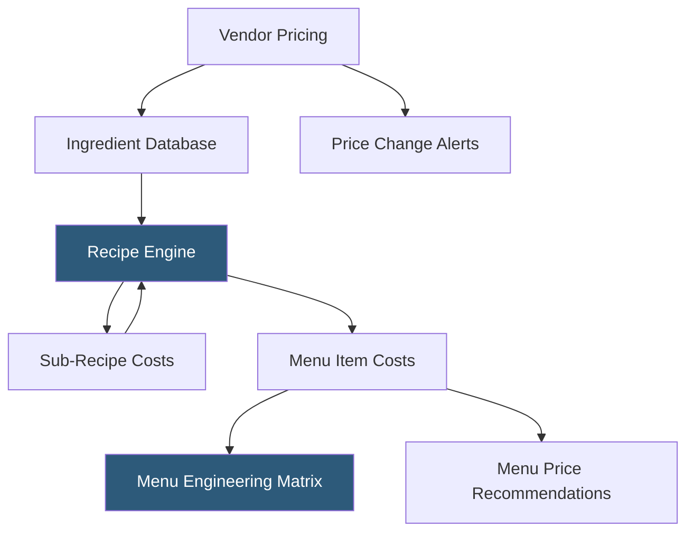

**Category:** Restaurant & Hospitality Hosting
**Difficulty:** Beginner
**Reading time:** 5 min read

---

Recipe costing software calculates the precise ingredient cost of every menu item, enabling restaurants to set profitable prices, identify underperforming dishes, and model the impact of ingredient price changes. Accurate recipe costing is foundational to menu engineering — understanding which items drive profit, which drive volume, and which should be repriced, reengineered, or removed. Cloud-based platforms update costs automatically when vendor prices change.

- **Cost Per Portion** — The total ingredient cost of one serving of a menu item, calculated from recipe quantities and ingredient prices
- **Food Cost Percentage** — Cost per portion divided by menu price, expressed as a percentage; typical targets range from 28–35% depending on segment
- **Sub-Recipe** — A preparation (sauce, stock, spice blend) that is an ingredient in multiple menu items and must be costed separately
- **Yield Factor** — Adjustment for ingredient weight loss during preparation (trim waste, cooking reduction, peeling)
- **Cost Sensitivity Analysis** — Modeling how ingredient price changes affect the food cost percentage of dependent recipes
- **Menu Engineering Matrix** — Classification of items by sales volume and profitability into Stars, Plowhorses, Puzzles, and Dogs

Recipe costing platforms maintain an ingredient database with current prices per purchase unit (per case, per pound, per each). Recipes are built by selecting ingredients and specifying quantities with appropriate units — a pasta dish might call for 4 oz dry pasta, 2 oz protein, and 3 oz sauce, each with their own per-portion cost contribution. Yield factors adjust for waste: if a whole chicken loses 30% weight when trimmed, the usable pound cost is higher than the purchase price per pound.

Sub-recipes handle compound preparations: a house-made marinara sauce has its own recipe with tomatoes, olive oil, garlic, and herbs. The sauce sub-recipe calculates a cost per ounce, and any menu item using the sauce references that sub-recipe at the specified quantity. When the price of canned tomatoes changes, the system recalculates the sauce sub-recipe cost and automatically updates the cost of every dish containing it.

The menu engineering matrix compares food cost percentage against sales volume to classify every item. Stars (low cost, high sales) drive profit and should be promoted. Dogs (high cost, low sales) should be removed. Plowhorses (high sales, high cost) should be reengineered to reduce cost. Puzzles (low sales, low cost) should be marketed or removed.

- Independent restaurants building their first systematic pricing model
- Operators evaluating whether to maintain, reprice, or remove low-margin items
- Chefs designing new menus with target food cost constraints
- Restaurant groups standardizing recipe costs across multiple kitchen teams
- F&B managers preparing for ingredient price negotiation with vendors

| Advantage | Disadvantage |
|-----------|--------------|
| Precise cost visibility for every menu item | Initial recipe entry requires significant time investment |
| Automatic recalculation when ingredient prices change | Accuracy depends on yield factors and precise portioning |
| Menu engineering analysis guides data-driven decisions | Software cost adds to overhead for small operations |
| Sub-recipe handling captures true cost of complex items | Ongoing maintenance required as menus evolve |

- [Inventory Management for Restaurants](inventory-management-for-restaurants.md)
- [MarketMan Inventory Platform](marketman-inventory-platform.md)
- [Restaurant Analytics Platforms](restaurant-analytics-platforms.md)

---
*Part of the [Restaurant & Hospitality Hosting](index.md) category · [Back to Master Index](../../index.md)*
