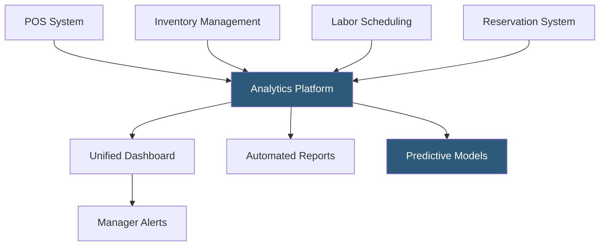

**Category:** Restaurant & Hospitality Hosting
**Difficulty:** Intermediate
**Reading time:** 6 min read

---

Restaurant analytics platforms aggregate data from POS systems, inventory management, labor scheduling, online ordering, and reservations into unified dashboards that surface actionable operational intelligence. These platforms move operators from reactive management based on intuition to proactive decision-making based on trends, benchmarks, and predictive forecasts. Modern analytics platforms integrate across the full restaurant technology stack.

- **Consolidated Reporting** — Unified view of sales, labor, food cost, and guest data from multiple integrated systems
- **Benchmark Comparison** — Performance metrics compared against similar restaurant types, regions, or internal targets
- **Labor Cost Percentage** — Labor costs as a percentage of revenue, typically targeting 28–35% combined with food cost
- **Same-Store Sales Comparison** — Year-over-year and period-over-period revenue comparison isolating organic growth
- **Prime Cost** — The combined food cost and labor cost percentage, the most watched composite KPI in restaurant operations
- **Predictive Analytics** — Forecasting future sales, staffing needs, and inventory requirements based on historical patterns

Restaurant analytics platforms connect to the POS via API or data export to ingest transaction-level data: every item sold, every discount applied, every payment method used. Labor data comes from scheduling and time-clock systems; inventory data comes from ordering and counting platforms; reservation data comes from booking systems. The analytics layer normalizes these datasets and calculates composite metrics.

Dashboards present metrics at configurable time granularities — hourly, daily, weekly, period, and annual views — with drill-down capability from summary to individual transactions. Multi-location operators can view consolidated totals alongside individual location performance, identifying outliers that warrant attention.

Automated alerts trigger when KPIs cross thresholds: if food cost percentage exceeds 35% for the week, or if a location's sales fall more than 10% below forecast, managers receive push notifications or emails. Predictive models use historical seasonality, day-of-week patterns, and external data like weather and local events to forecast covers and revenue, supporting accurate prep planning and staffing decisions.

- Multi-location operators needing consolidated performance visibility
- Restaurant groups benchmarking location performance against each other
- Operators building data-driven labor scheduling based on sales forecasts
- Investors and management companies monitoring portfolio restaurant performance
- Restaurants targeting specific prime cost improvements as strategic initiatives

| Advantage | Disadvantage |
|-----------|--------------|
| Unified view eliminates switching between multiple reporting systems | Integration setup required for each connected system |
| Automated alerts surface problems before they compound | Data quality depends on clean POS and operational data entry |
| Predictive forecasting improves staffing and prep accuracy | Advanced analytics require time to build meaningful historical baselines |
| Benchmark comparisons contextualize performance | Platform cost adds to operational overhead |

- [Toast POS Restaurant Platform](toast-pos-restaurant-platform.md)
- [Inventory Management for Restaurants](inventory-management-for-restaurants.md)
- [Recipe Costing Software](recipe-costing-software.md)

---
*Part of the [Restaurant & Hospitality Hosting](index.md) category · [Back to Master Index](../../index.md)*
