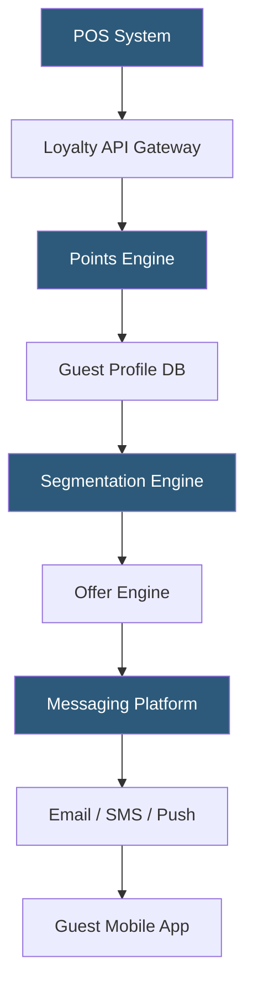

**Category:** Restaurant & Hospitality Hosting
**Difficulty:** Intermediate
**Reading time:** 6 min read

---

Restaurant loyalty programs are cloud-hosted platforms that track guest spending, award points or stamps, and drive repeat visits through personalized rewards. They integrate with POS systems to capture transaction data automatically and use CRM engines to segment guests and trigger targeted marketing. Modern platforms combine loyalty mechanics with email, SMS, and app-based engagement in a unified stack.

- **Points Engine** — the backend service that calculates, stores, and redeems loyalty currency per transaction
- **Tier System** — a hierarchy of loyalty levels (e.g., Silver, Gold, Platinum) unlocking escalating benefits
- **POS Integration** — real-time API connection between the loyalty platform and the point-of-sale to capture check data
- **Redemption Flow** — the UX and backend logic for converting earned points into discounts or free items
- **Guest CDP** — customer data platform aggregating transaction history, preferences, and visit frequency
- **Offer Engine** — rules-based system generating personalized offers based on guest behavior segments
- **Punch Card Digital** — a simple visit-count mechanic migrated to digital form, often the entry-level loyalty type

Restaurant loyalty platforms capture transaction data through POS integration. When a guest pays, the POS sends a webhook or direct API call containing check amount, item details, timestamp, and guest identifier (phone number, email, or loyalty card) to the loyalty platform's API gateway. The points engine applies the venue's earning rules—typically dollars spent per point, bonus multipliers for certain categories, or visit-based stamps—and credits the guest's account in near real-time.

Guest profiles accumulate a rich history: visit frequency, average check, preferred daypart, and dietary patterns inferred from item purchases. The segmentation engine runs batch or streaming jobs to group guests into cohorts (lapsed, high-value, at-risk, new). The offer engine then evaluates each segment against configured promotion logic and dispatches personalized incentives through the messaging platform—a "We miss you" email after 30 days of inactivity, or a birthday free dessert offer timed one week before the date.

Redemption happens either at POS lookup (guest provides phone number, staff applies reward) or through in-app QR codes scanned at payment. The platform maintains an idempotency ledger to prevent double redemption and records each event for audit. Multi-location operators use a central loyalty server shared across properties, so points earned at one location are redeemable at another.

Leading platforms include Punchh, Paytronix, Thanx, and Toast Loyalty. They provide hosted infrastructure, SDKs for mobile app embedding, and analytics dashboards measuring enrollment rate, redemption rate, and incremental revenue lift.

- Driving repeat visits through point accumulation and tier rewards
- Reactivating lapsed guests with targeted win-back campaigns
- Birthday and anniversary personalization to increase emotional connection
- Cross-sell promotions based on purchase history (e.g., never ordered dessert)
- Franchise-wide loyalty with centralized guest identity

| Advantage | Disadvantage |
|-----------|--------------|
| Measurable ROI through visit frequency tracking | Integration complexity with existing POS |
| Personalization increases average check size | Program liability grows as unredeemed points accumulate |
| Owned guest data vs. third-party delivery platforms | Guest enrollment friction reduces adoption rate |
| Automated campaigns reduce marketing labor | Ongoing subscription cost for hosted platform |

- [Gift Card Management Systems](gift-card-management-systems.md)
- [Restaurant Marketing Automation](restaurant-marketing-automation.md)
- [Restaurant Analytics Platforms](restaurant-analytics-platforms.md)

---
*Part of the [Restaurant & Hospitality Hosting](index.md) category · [Back to Master Index](../../index.md)*
