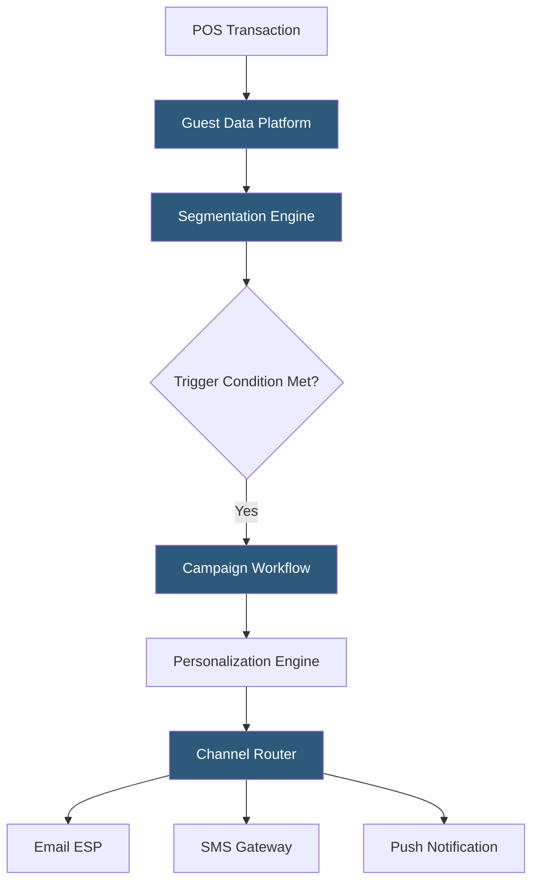

**Category:** Restaurant & Hospitality Hosting
**Difficulty:** Intermediate
**Reading time:** 6 min read

---

Restaurant marketing automation platforms connect guest data from POS systems, reservation tools, and loyalty programs to automatically trigger personalized communications across email, SMS, and push channels. They replace manual campaign creation with behavior-driven workflows that fire based on visit patterns, lifecycle events, and spending thresholds.

- **Trigger-Based Campaign** — a message automatically sent when a guest meets a defined behavioral condition
- **Guest Segmentation** — dividing the guest database into cohorts based on recency, frequency, and monetary value (RFM)
- **Drip Sequence** — a time-based series of messages sent after an initial trigger event like first visit
- **ESP Integration** — connection to an email service provider (Mailchimp, Klaviyo, SendGrid) for high-volume delivery
- **SMS Gateway** — a platform routing text messages through carriers (Twilio, Bandwidth) with opt-in compliance
- **Revenue Attribution** — linking campaign sends to subsequent visits or orders to calculate campaign ROI
- **Suppression List** — guests excluded from campaigns due to opt-out status or recent communication to prevent fatigue

Restaurant marketing automation begins with data ingestion. Transaction records from the POS flow into a guest data platform that normalizes guest identities across channels—matching email addresses from loyalty enrollment, phone numbers from SMS opt-ins, and POS check records into unified profiles. Platforms like Thanx, Paytronix, and Fishbowl specialize in this restaurant-specific identity resolution.

The segmentation engine continuously evaluates guests against configured RFM criteria. A guest who visited weekly but has not returned in 30 days enters the "at-risk" segment; a guest who visited three times in their first month enters the "high-potential" segment. These segment memberships feed trigger conditions: when a guest enters "at-risk," the automation fires a win-back workflow.

Each workflow defines a sequence of actions: wait 30 days after last visit → send email with 10% offer → wait 7 days → if no visit, send SMS with escalated offer → wait 14 days → if still no visit, suppress further outreach. The personalization engine populates templates with the guest's name, most ordered items, preferred location, and offer codes generated uniquely per guest to prevent sharing.

Delivery routes through integrated ESPs (for email) and SMS gateways, respecting channel opt-in status and time-of-day sending rules to avoid early-morning messages. Revenue attribution closes the loop by matching post-campaign POS transactions to campaign recipients, calculating cost-per-visit and incremental revenue lift.

- Win-back campaigns for lapsed guests after defined inactivity periods
- Birthday reward emails sent 1–2 weeks before the guest's birthday
- Post-first-visit nurture sequences to convert one-time visitors to regulars
- Event promotion to guests who have visited during similar occasions
- Survey requests following visits to gather NPS and review generation

| Advantage | Disadvantage |
|-----------|--------------|
| Automated campaigns run 24/7 without staff involvement | Requires clean, opted-in guest data to operate legally |
| Behavior-based targeting outperforms batch-and-blast | Platform cost scales with database size and message volume |
| Measurable ROI through attribution reporting | Poor segmentation can lead to message fatigue and opt-outs |
| Consistent guest lifecycle coverage | Initial setup and workflow configuration requires marketing expertise |

- [Restaurant Loyalty Programs](restaurant-loyalty-programs.md)
- [Restaurant Analytics Platforms](restaurant-analytics-platforms.md)
- [Gift Card Management Systems](gift-card-management-systems.md)

---
*Part of the [Restaurant & Hospitality Hosting](index.md) category · [Back to Master Index](../../index.md)*
