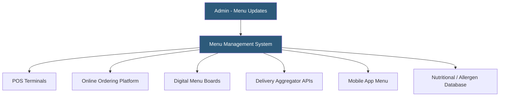

**Category:** Restaurant & Hospitality Hosting
**Difficulty:** Beginner
**Reading time:** 5 min read

---

Restaurant menu management systems provide centralized control over item descriptions, pricing, availability, modifiers, and nutritional information across all ordering channels. Modern menu management separates the menu data layer from individual channel displays, enabling a single update to propagate instantly to the POS, online ordering site, digital menu boards, delivery aggregators, and mobile apps simultaneously.

- **Menu Item Master** — The authoritative record of each menu item including name, description, price, photo, and modifiers
- **Channel Syndication** — Publishing menu data to multiple downstream channels from a single source of truth
- **86 Management** — Real-time item unavailability flagging that removes sold-out items from all ordering channels
- **Modifier Groups** — Structured choice sets (size, protein, toppings) with forced and optional selections and pricing rules
- **Menu Versioning** — Maintaining different menu configurations for breakfast/lunch/dinner, seasonal changes, or location variations
- **Nutritional Compliance** — Calorie and allergen data management for regulatory compliance in applicable markets

Menu management platforms maintain a structured database of every item, modifier, price, and configuration rule. When a manager updates a price or marks an item unavailable, the system propagates that change through API connections to every channel the restaurant operates. For POS systems, updates push over the internet to terminals in real time. For delivery aggregators like DoorDash and Uber Eats, updates transmit via the aggregator's menu API.

Modifier groups define the structured choices guests make when ordering — forced selections (every burger must have a bun type) and optional additions (available extras with or without additional charges) are modeled separately with pricing rules attached. Complex configurations like combo meals, half-and-half pizza options, or build-your-own bowls require nested modifier structures.

Menu versioning schedules automatic transitions between menu configurations — a brunch menu activating at 10am on weekends and reverting to the standard menu at 3pm, for example. Nutritional management tracks calorie counts and allergen declarations, with reporting tools for FDA calorie disclosure compliance requirements applying to chains over 20 locations. Integration with recipe management systems enables automatic nutritional calculation when ingredient quantities change.

- Multi-location restaurant groups managing consistent menus across dozens of POS systems
- Restaurants selling on multiple delivery platforms needing synchronized availability
- Quick-service chains with complex modifier structures and LTO (limited time offer) programs
- Operations with regulatory calorie disclosure compliance requirements
- Restaurants running breakfast/lunch/dinner daypart menus that switch on schedules

| Advantage | Disadvantage |
|-----------|--------------|
| Single update propagates to all channels instantly | Integration setup with each channel requires development effort |
| Eliminates inconsistency between POS and online menus | Requires discipline in maintaining master data accuracy |
| Scheduled daypart transitions reduce manual labor | Complex modifier structures require careful data modeling |
| Centralized nutritional data management for compliance | Aggregator API limitations may cause delayed sync in some cases |

- [Digital Menu Board Hosting](digital-menu-board-hosting.md)
- [Toast POS Restaurant Platform](toast-pos-restaurant-platform.md)
- [Popmenu Digital Menu Platform](popmenu-digital-menu-platform.md)

---
*Part of the [Restaurant & Hospitality Hosting](index.md) category · [Back to Master Index](../../index.md)*
