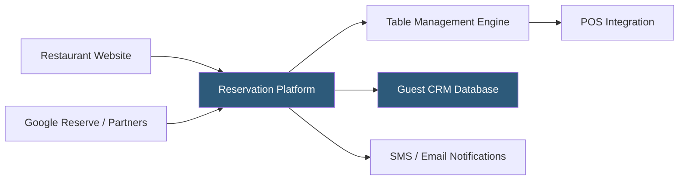

**Category:** Restaurant & Hospitality Hosting
**Difficulty:** Beginner
**Reading time:** 5 min read

---

Restaurant reservation systems are cloud-hosted platforms that manage table bookings, waitlists, and guest data across dining operations. They replace paper reservation books with digital tools that track covers, optimize table turns, and capture guest preferences. Modern systems integrate with POS platforms and marketing tools to create unified guest profiles spanning multiple visits.

- **Cover Management** — Tracking the number of guests expected per service to plan staffing and inventory
- **Table Optimization** — Algorithms that assign parties to tables minimizing dead seat time while matching party size to table capacity
- **Waitlist Management** — Digital queue for walk-in guests with SMS notifications when tables become available
- **Guest CRM** — Profile database storing dietary restrictions, preferences, anniversaries, and visit history
- **Two-Way Messaging** — SMS or email confirmation and reminder communication with guests
- **Channel Integration** — Aggregating reservations from multiple booking sources (direct, Google, partner platforms) into one system

Reservation platforms expose a booking widget embeddable on the restaurant's website and connect with Google's Reserve with Google feature, allowing guests to book directly from search results. When a booking is made, the system checks available inventory against configured table combinations and pacing rules — limits on how many new covers can start within a given 15-minute window to prevent kitchen overload.

Confirmed reservations generate automatic email and SMS confirmations with unique cancellation links, reducing no-shows. As service approaches, staff use the digital floor map to seat arriving parties, with the system suggesting optimal table assignments. Waitlist management captures walk-ins with estimated wait times and notifies guests via SMS when their table is ready.

Guest profiles accumulate over time: allergy notes added before one visit appear automatically in future reservations, server notes capture preferences, and CRM tools enable email marketing campaigns to loyal guests. POS integration links reservation data to check data, connecting covers booked to revenue generated.

- Fine dining restaurants managing limited seating with high demand
- Casual dining operators eliminating phone reservation overhead
- Hotel restaurants coordinating covers with concierge recommendations
- Multi-location groups building unified guest databases across properties
- Restaurants running special events or prix fixe menus with fixed capacity

| Advantage | Disadvantage |
|-----------|--------------|
| Eliminates phone reservation labor costs | Platform fees plus per-cover charges add up |
| Reduces no-shows through automated reminders | Guest data may be shared with third-party platforms |
| Captures guest preferences for personalized service | Table optimization algorithms may not match host intuition |
| Integrates multiple booking channels in one system | Dependency on platform availability for bookings |

- [OpenTable Reservation Platform](opentable-reservation-platform.md)
- [Resy Reservation Hosting](resy-reservation-hosting.md)
- [Table Management Systems](table-management-systems.md)

---
*Part of the [Restaurant & Hospitality Hosting](index.md) category · [Back to Master Index](../../index.md)*
