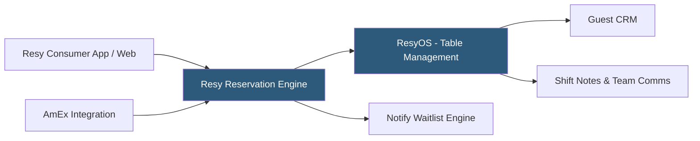

**Category:** Restaurant & Hospitality Hosting
**Difficulty:** Beginner
**Reading time:** 5 min read

---

Resy is a restaurant reservation and table management platform known for its strong adoption among upscale independent restaurants and culinary destination dining. Acquired by American Express in 2019, Resy offers restaurants flat-fee subscription pricing rather than per-cover charges, and gives operators more control over their guest data. The platform's prestige positioning and AmEx integration make it popular with fine dining and trendsetting establishments.

- **Flat-Fee Pricing** — Subscription model rather than per-cover charges, reducing cost predictability concerns
- **AmEx Integration** — American Express cardholders receive priority access to certain Resy reservations, driving premium diner traffic
- **Notify Feature** — Automated waitlist notification system alerting interested guests when tables open for fully-booked restaurants
- **ResyOS** — The operator-facing reservation and table management operating system
- **Resy Network** — Consumer app and website connecting diners to restaurant inventory
- **Shift Notes** — Internal communication tool for front-of-house teams about VIP guests, special events, and service requirements

Resy operates as a SaaS platform with ResyOS accessible via web browser and the Resy mobile app for front-of-house staff. Restaurants configure their floor plan, service pacing, and table availability within ResyOS, and the system distributes this inventory to the Resy consumer network. The Notify feature allows diners to join a digital waitlist for fully-booked restaurants, with automatic notifications when a cancellation opens a slot matching their preferences.

The American Express partnership provides cardholders access to Resy Global Dining Access, including exclusive reservations at premium restaurants and priority queue placement. This drives a high-value diner demographic to Resy-listed restaurants. Restaurant operators retain more control over their guest data compared to OpenTable — contact information and dining history are more clearly restaurant property under Resy's terms.

Shift notes and internal messaging tools support pre-service briefings, VIP guest flagging, and event coordination. Resy integrates with Toast and other POS platforms to connect reservation data with transaction records.

- Independent fine dining and upscale casual restaurants seeking alternatives to OpenTable's per-cover fees
- Restaurants attracting high-value AmEx cardholders
- Culinary hotspot restaurants managing high demand and waitlists
- Operators who want clearer ownership of their guest data
- Restaurant groups building premium brand positioning

| Advantage | Disadvantage |
|-----------|--------------|
| Flat-fee pricing is more predictable than per-cover models | Smaller diner network than OpenTable in most markets |
| Clearer restaurant ownership of guest data | Less table management depth than some competitors |
| AmEx integration drives premium diner traffic | AmEx partnership may limit appeal to non-card holders |
| Strong brand cachet among upscale restaurants | Geographic coverage weaker outside major metro areas |

- [OpenTable Reservation Platform](opentable-reservation-platform.md)
- [Restaurant Reservation Systems](restaurant-reservation-systems.md)
- [Yelp Reservations Integration](yelp-reservations-integration.md)

---
*Part of the [Restaurant & Hospitality Hosting](index.md) category · [Back to Master Index](../../index.md)*
