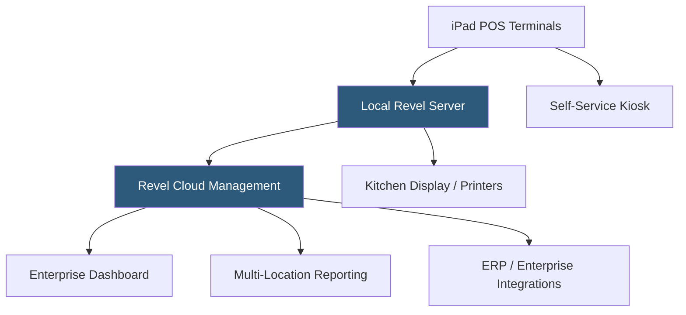

**Category:** Restaurant & Hospitality Hosting
**Difficulty:** Intermediate
**Reading time:** 6 min read

---

Revel Systems is an enterprise-grade iPad POS platform serving large restaurant chains, franchises, and multi-location operators. It distinguishes itself through robust offline capabilities, deep customization options, and a flexible architecture supporting complex enterprise workflows. Revel's Always On technology allows full operation without any internet connection for extended periods.

- **Always On Mode** — Local processing architecture that sustains full POS operation indefinitely without internet connectivity
- **Enterprise Dashboard** — Centralized multi-location management portal for menu, pricing, and reporting control
- **Franchise Management** — Hierarchical permissions and configuration inheritance for franchise networks
- **Self-Service Kiosk** — Integrated customer-facing ordering kiosks reducing labor and increasing throughput
- **Revel Advantage** — Bundled hardware, software, and payments package with a single support contact
- **Open API** — Comprehensive REST API for deep enterprise system integrations

Revel's architecture uses a local Mini server within the restaurant that handles all transaction processing independently of the internet. iPads connect to this local server over the restaurant's Wi-Fi, so even a complete internet outage does not interrupt service. Data syncs to Revel's cloud when connectivity is available, providing management with remote access to reporting and configuration.

The Enterprise Dashboard enables corporate-level administrators to push menu updates, pricing changes, and promotions to individual locations, regions, or the entire chain simultaneously. Franchise hierarchies are modeled in the permission system — a franchisee can customize certain elements while corporate controls brand-standard items. The self-service kiosk module integrates natively with the POS, routing kiosk orders to the kitchen identically to cashier-entered orders.

Revel's open API supports bidirectional data exchange with ERP systems, loyalty platforms, labor management tools, and accounting software. The platform handles complex menu structures including combo meals, timed promotions, and bundled pricing common in QSR chains.

- Quick-service restaurant chains with high transaction volumes
- Franchise networks requiring centralized menu and pricing control
- Multi-concept operators managing different restaurant brands
- Environments with unreliable internet connectivity
- Enterprises needing deep ERP and loyalty system integrations

| Advantage | Disadvantage |
|-----------|--------------|
| True indefinite offline operation via local server | Requires on-site hardware maintenance and IT support |
| Strong enterprise and franchise management tools | Higher total cost than SMB-focused platforms |
| Deep API for enterprise system integration | Longer implementation timeline than plug-and-play alternatives |
| Self-service kiosk natively integrated | Contract terms typically require multi-year commitments |

- [Oracle MICROS Hosting](oracle-micros-hosting.md)
- [NCR Aloha Cloud](ncr-aloha-cloud.md)
- [Restaurant Analytics Platforms](restaurant-analytics-platforms.md)

---
*Part of the [Restaurant & Hospitality Hosting](index.md) category · [Back to Master Index](../../index.md)*
