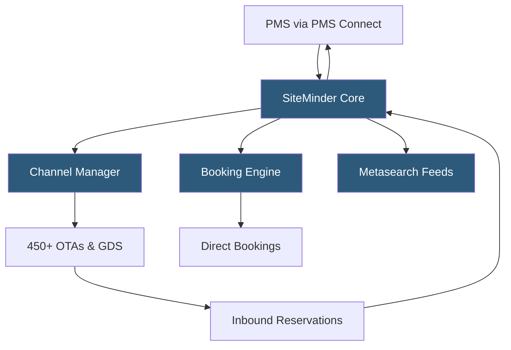

**Category:** Restaurant & Hospitality Hosting
**Difficulty:** Intermediate
**Reading time:** 6 min read

---

SiteMinder is the world's largest hotel distribution platform, connecting over 42,000 hotels to more than 450 distribution channels including OTAs, GDS, and direct booking engines. Its cloud-hosted channel manager provides real-time ARI synchronization, a direct booking engine, and a hotel commerce platform designed to maximize direct revenue while managing third-party distribution costs.

- **Hotel Commerce Platform** — SiteMinder's unified product combining channel manager, booking engine, metasearch, and analytics
- **Little Hotelier** — SiteMinder's all-in-one PMS + channel manager product targeting very small properties
- **GDS Connectivity** — connections to Amadeus, Sabre, and Travelport for corporate travel bookings routed through SiteMinder
- **Metasearch Integration** — direct connections to Google Hotel Ads, TripAdvisor, and Trivago enabling direct booking at metasearch cost-per-click rates
- **Rate Shopper** — a competitive intelligence tool showing how a property's rates compare to competitor hotels on OTAs
- **Direct Booking** — reservations completed through the property's own SiteMinder-hosted booking page, avoiding OTA commission
- **PMS Connect** — SiteMinder's PMS integration layer supporting 350+ PMS systems for two-way data sync

SiteMinder's infrastructure handles over 100 million property-to-channel data exchanges daily. The platform maintains persistent connections with OTAs using each channel's preferred integration protocol—some channels use HTTPS push with XML, others use pull-based polling, and newer channels use REST APIs with JSON. SiteMinder manages all protocol variations internally, presenting hotels with a uniform interface for rate and availability management.

Rate updates in SiteMinder cascade across channels through a rule engine. A property defines a base rate, then configures channel-specific adjustments (e.g., "Add 15% commission markup for Booking.com so the net rate equals the desired sell rate"). Derived rates automatically recalculate when the base rate changes, and updates queue for delivery to each channel. High-priority channels (direct booking engine) receive updates synchronously; OTAs receive updates within 30 seconds via an asynchronous job queue.

Metasearch connectivity allows hotels to bid on Google Hotel Ads using a cost-per-click model rather than paying OTA commission. When a traveler searches Google Hotels, SiteMinder feeds the property's live rates and redirects clicks to the hotel's direct booking page. This direct channel typically yields 10–15% more net revenue per booking compared to OTA channels.

The Rate Shopper feature scrapes competitor rates from OTA listings up to six times daily and displays them alongside the property's own rates, allowing revenue managers to make informed pricing decisions without leaving the platform.

- Mid-size independent hotels managing 10–50 OTA channel connections
- Hotel groups needing centralized rate management across properties
- Properties wanting to grow direct booking share via metasearch
- Revenue managers requiring competitive rate intelligence
- Small inns and B&Bs using Little Hotelier for combined PMS and distribution

| Advantage | Disadvantage |
|-----------|--------------|
| 450+ channel connections reduce OTA certification burden | Higher cost than simpler channel managers for small properties |
| Metasearch integration drives direct bookings | Setup complexity for properties with many room types and rate plans |
| Rate shopper built-in eliminates third-party subscription | Support quality varies by region and property tier |
| 350+ PMS integrations via PMS Connect | Channel update latency during high-traffic periods |

- [Hotel Channel Manager Hosting](hotel-channel-manager-hosting.md)
- [Hotel Booking Engine Hosting](hotel-booking-engine-hosting.md)
- [Hotel Property Management Systems (PMS)](hotel-property-management-systems-pms.md)

---
*Part of the [Restaurant & Hospitality Hosting](index.md) category · [Back to Master Index](../../index.md)*
