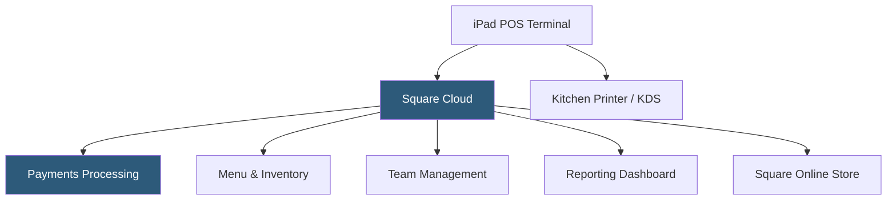

**Category:** Restaurant & Hospitality Hosting
**Difficulty:** Beginner
**Reading time:** 5 min read

---

Square for Restaurants is a cloud-based POS solution tailored to foodservice operations, built on Square's broader payments infrastructure. It offers affordable entry pricing with no long-term hardware contracts, making it popular among independent restaurants, cafes, and food trucks. Square handles payments, menu management, floor plans, and reporting with deep integration into Square's ecosystem of financial and marketing tools.

- **Square Hardware** — iPad-based terminals, Square Stand, and Square Terminal devices that accept chip, swipe, and contactless payments
- **Course Management** — Firing courses independently to the kitchen, allowing staggered preparation timing
- **Seat & Table Management** — Digital floor plan assignment of orders to specific seats for split-check accuracy
- **Square Team Management** — Built-in labor scheduling, time tracking, and tip management integrated with payroll
- **Square Capital** — Embedded business financing based on Square payment history
- **Open API** — Developer API enabling custom integrations with third-party tools

Square for Restaurants runs on iPad hardware paired with Square's purpose-built stands and payment readers. The POS connects to Square's cloud over the internet, with data synchronized to the Square Dashboard accessible from any browser. Menu configuration, pricing, and modifier setup happen in the web dashboard and push to all connected terminals.

Transactions are processed through Square's integrated payment gateway, with funds deposited typically within one to two business days. The platform supports split checks by seat, item, or percentage, and handles complex modifier trees for customizable menu items. Kitchen routing sends tickets to designated printers or KDS screens by category (hot, cold, bar).

Square's reporting aggregates sales by item, employee, time period, and payment method. The platform integrates with QuickBooks, Xero, and numerous accounting platforms via Square's App Marketplace. For restaurants outgrowing basic features, Square for Restaurants Plus adds multi-location management, advanced reporting, and unlimited POS devices per location.

- Independent cafes and coffee shops needing affordable, no-contract POS
- Food trucks requiring mobile payment processing
- Small full-service restaurants wanting integrated ordering and payments
- Pop-up dining concepts needing quick deployment
- Restaurant groups managing multiple concepts under one Square account

| Advantage | Disadvantage |
|-----------|--------------|
| No long-term hardware contracts | Less robust than enterprise POS for high-volume operations |
| Free tier available for basic use | Transaction fees apply on all payments |
| Broad ecosystem of financial tools | iPad hardware less durable than purpose-built restaurant terminals |
| Easy setup and onboarding | Advanced features require paid subscription tiers |

- [Toast POS Restaurant Platform](toast-pos-restaurant-platform.md)
- [Clover for Restaurants](clover-for-restaurants.md)
- [Restaurant Analytics Platforms](restaurant-analytics-platforms.md)

---
*Part of the [Restaurant & Hospitality Hosting](index.md) category · [Back to Master Index](../../index.md)*
