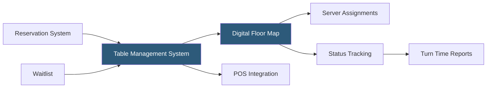

**Category:** Restaurant & Hospitality Hosting
**Difficulty:** Beginner
**Reading time:** 5 min read

---

Table management systems provide front-of-house staff with a digital floor plan showing the real-time status of every table in the restaurant. They replace hand-drawn floor maps and mental tracking of seating with software that monitors table occupancy, turn times, server sections, and party assignments. Modern systems integrate with reservations, waitlists, and POS to provide a complete picture of the dining room.

- **Digital Floor Map** — Interactive visualization of the restaurant layout with color-coded table status indicators
- **Table Status Tracking** — Real-time states: Available, Seated, Ordered, Food Running, Check Dropped, Needs Bussing
- **Turn Time Analytics** — Measurement of how long parties occupy tables, informing waitlist estimates and staffing
- **Server Section Management** — Assignment of tables to servers with workload balancing and transfer capability
- **Two-Top / Four-Top Optimization** — Algorithms combining tables for larger parties or splitting for smaller ones
- **Covers Counter** — Live tracking of guests currently in the restaurant against capacity and reservation forecasts

Table management systems maintain a database of the restaurant's physical layout — tables, their positions, capacities, and section assignments — displayed as an interactive visual map. As guests are seated, servers bump courses, checks are dropped, and tables are cleared, staff update table statuses through taps or swipes on the interface. Color coding makes the floor's status immediately readable from across the room.

POS integration automatically advances table status when certain events occur: when a first item is ordered, status moves from Seated to Ordered; when the check is opened, it advances to Check Dropped. This reduces the manual status update burden on hosts and managers. Reservation data feeds pending arrivals into the expected covers queue, allowing hosts to plan seating sequences in advance.

Turn time analytics aggregate historical data to calculate average occupancy time by party size, day, and service period. These benchmarks feed waitlist estimates — "your table will be ready in approximately 20 minutes" — improving the accuracy of guest communications and reducing the frustration of significantly wrong estimates.

- Full-service restaurants managing complex dining rooms with multiple sections
- Restaurants running both reservation and walk-in seating simultaneously
- High-volume operations where floor management efficiency directly impacts revenue
- Hotel restaurants coordinating with concierge for reservation flows
- Multi-outlet venues managing seating across bar, patio, and dining room separately

| Advantage | Disadvantage |
|-----------|--------------|
| Real-time visibility eliminates guesswork in floor management | Requires consistent staff discipline in status updates |
| Turn time data improves waitlist accuracy | Setup requires accurate floor map configuration |
| Integration with reservations and POS reduces manual updates | Staff training investment for adoption |
| Analytics support staffing and layout optimization decisions | Software cost added to operational overhead |

- [Restaurant Reservation Systems](restaurant-reservation-systems.md)
- [Waitlist Management Hosting](waitlist-management-hosting.md)
- [Toast POS Restaurant Platform](toast-pos-restaurant-platform.md)

---
*Part of the [Restaurant & Hospitality Hosting](index.md) category · [Back to Master Index](../../index.md)*
