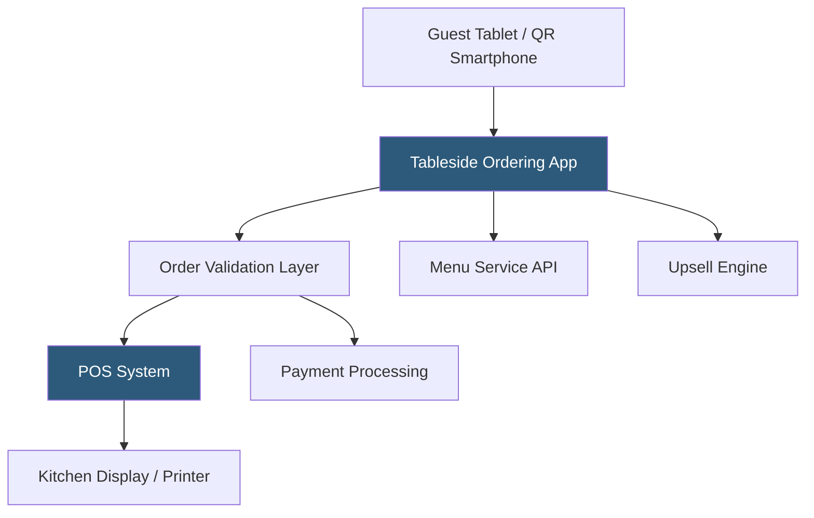

**Category:** Restaurant & Hospitality Hosting
**Difficulty:** Intermediate
**Reading time:** 6 min read

---

Tableside ordering systems allow guests to place orders directly from their table using handheld devices, tablets mounted at the table, or their own smartphones, reducing the time between seating and order placement. These systems decrease server labor per table while improving order accuracy, increasing add-on attachment rates, and accelerating table turns. The infrastructure connects tablets or QR-based interfaces to the restaurant's POS and kitchen systems.

- **Guest-Facing Tablet** — Mounted or handheld device at each table displaying the menu and enabling direct order entry
- **QR Code Menu Ordering** — Smartphone-based ordering initiated by scanning a table QR code, requiring no dedicated hardware
- **Order Approval Workflow** — Optional server review step before orders are committed to the kitchen
- **Upsell Prompting** — Contextual modifier and add-on suggestions increasing average check through algorithmic prompting
- **Pay-at-Table** — EMV and NFC payment capability at tableside, reducing server trips and accelerating table turns
- **Kitchen Direct** — Orders submitted directly to KDS or printers without server re-entry

Hardware-based tableside systems use tablets (iPad or purpose-built Android devices) mounted on table stands or provided as handhelds. The tablet application connects to the restaurant's menu API to display current items, photos, and descriptions. When guests place an order, it transmits to a cloud intermediary that validates the order and injects it into the POS, which routes tickets to the appropriate kitchen stations.

QR code-based systems eliminate hardware investment by using the guest's own smartphone. The guest scans a QR code on the table, opens a mobile browser or PWA (Progressive Web App), browses the menu, and submits their order. The infrastructure is identical to tablet-based systems, with the delivery mechanism being the guest's device rather than restaurant hardware.

Pay-at-table features integrate a card reader into the tableside device or use NFC for contactless payment directly at the table. This removes the payment step from the server workflow entirely — the guest views their itemized check on the tablet, applies any loyalty rewards or gift cards, adds a tip, and pays without server involvement, freeing the server for other tables during what was previously dead time.

- Casual dining chains reducing server-to-table ratios during labor shortages
- Fast-casual restaurants transitioning to self-service ordering without losing table service feel
- High-volume tourist areas needing multilingual menu support
- Restaurants wanting to increase upsell attachment without training pressure on servers
- Operators seeking faster table turns during peak service periods

| Advantage | Disadvantage |
|-----------|--------------|
| Reduces server trips and increases table capacity per server | Technology can reduce personal service quality perception |
| Higher add-on attachment through algorithmic upselling | Hardware maintenance and replacement costs for tablet systems |
| Faster order placement reduces perceived wait time | QR code ordering requires guest comfort with smartphone ordering |
| Pay-at-table accelerates table turns significantly | Integration complexity with POS and payment systems |

- [QR Code Menu Hosting](qr-code-menu-hosting.md)
- [Kitchen Display System (KDS) Cloud](kitchen-display-system-kds-cloud.md)
- [Toast POS Restaurant Platform](toast-pos-restaurant-platform.md)

---
*Part of the [Restaurant & Hospitality Hosting](index.md) category · [Back to Master Index](../../index.md)*
